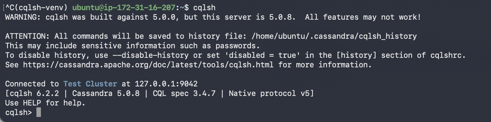
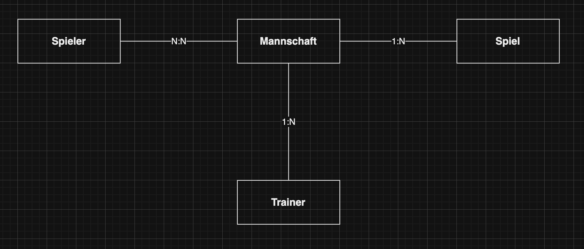
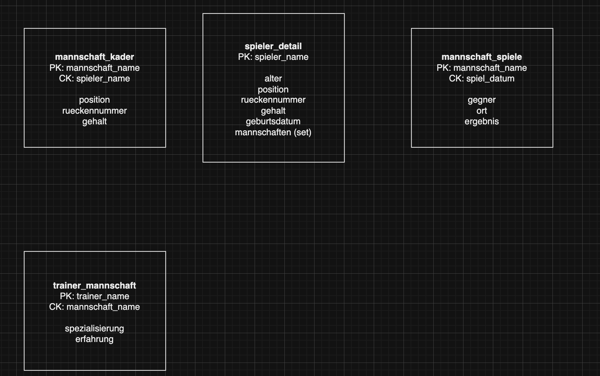

# KN-C-01 - Installation und Datenmodellierung fuer Cassandra

**Thema:** Fussballverein "FC Muster" (gleich wie bei den MongoDB/Neo4j Aufgaben)

---

## Teil A: Installation / Account erstellen (10%)

### Variante: Docker

Ich habe Cassandra via Docker installiert. Das ist die einfachste Variante und funktioniert zuverlaessig.

```bash
docker pull cassandra:latest
docker run --name cassandra -p 9042:9042 -p 9160:9160 -d cassandra:latest
```

Nach ein paar Minuten Wartezeit (Cassandra braucht etwas zum Hochfahren) kann man sich mit cqlsh verbinden:

```bash
docker exec -it cassandra cqlsh
```

### Verbindung testen

Screenshot cqlsh:


### DataGrip (optional)

Ich habe zusaetzlich DataGrip installiert fuer die grafische Oberflache.

Screenshot DataGrip:



---

## Teil B: Logisches Modell fuer Cassandra (40%)

### Grundlage

Gleiches konzeptionelles Modell wie bei den vorherigen Aufgaben: **FC Muster** mit Spieler, Mannschaft, Trainer und Spiel.



Bei Cassandra geht es nicht darum, ein universelles Modell zu erstellen, sondern die Tabellen **pro Abfrage-Szenario (Screen)** zu optimieren. Daten werden redundant gespeichert - das ist explizit erwunscht!

### Szenarien / Screens

Ich habe mich auf 4 Screens beschraenkt:

| Screen | Beschreibung |
|--------|-------------|
| **1. Mannschaftskader** | Alle Spieler einer Mannschaft anzeigen mit Position und Nummer |
| **2. Spielerprofil** | Details zu einem Spieler anzeigen (inkl. Mannschaften) |
| **3. Spielplan** | Alle Spiele einer Mannschaft sortiert nach Datum |
| **4. Trainerteam** | Trainer mit ihren Mannschaften anzeigen |

### Logisches Modell (visuell)



*Originalfile: `logisch.drawio`*

### Tabellen und Keys

**Tabelle 1: `mannschaft_kader`**
- **Partition Key:** `mannschaft_name`
- **Cluster Key:** `spieler_name`
- **Spalten:** position, rueckennummer, gehalt
- **Begruendung:** Pro Mannschaft werden alle Spieler auf einmal geladen. Der Cluster Key sortiert alphabetisch.

**Tabelle 2: `spieler_detail`**
- **Partition Key:** `spieler_name`
- **Spalten:** alter, position, rueckennummer, gehalt, geburtsdatum, mannschaften (Set<text>)
- **Begruendung:** Jeder Spieler hat eine eigene Partition. Kein Cluster Key noetig, da es pro Spieler nur eine Zeile gibt.

**Tabelle 3: `mannschaft_spiele`**
- **Partition Key:** `mannschaft_name`
- **Cluster Key:** `spiel_datum`
- **Spalten:** gegner, ort, ergebnis
- **Begruendung:** Pro Mannschaft werden alle Spiele geladen, sortiert nach Datum. Ideal fuer den Spielplan.

**Tabelle 4: `trainer_mannschaft`**
- **Partition Key:** `trainer_name`
- **Cluster Key:** `mannschaft_name`
- **Spalten:** spezialisierung, erfahrung
- **Begruendung:** Ein Trainer kann mehrere Mannschaften haben. Pro Trainer wird eine Partition erstellt.

---

## Teil C: Physisches Modell fuer Cassandra (50%)

### Skript

Script: `create-keyspace.cql`

```cassandra
CREATE KEYSPACE fc_muster
WITH replication = {
  'class': 'SimpleStrategy',
  'replication_factor': 1
};

USE fc_muster;

CREATE TABLE mannschaft_kader (
    mannschaft_name text,
    spieler_name text,
    position text,
    rueckennummer int,
    gehalt double,
    PRIMARY KEY (mannschaft_name, spieler_name)
);

CREATE TABLE spieler_detail (
    spieler_name text,
    alter int,
    position text,
    rueckennummer int,
    gehalt double,
    geburtsdatum date,
    mannschaften set<text>,
    PRIMARY KEY (spieler_name)
);

CREATE TABLE mannschaft_spiele (
    mannschaft_name text,
    spiel_datum date,
    gegner text,
    ort text,
    ergebnis text,
    PRIMARY KEY (mannschaft_name, spiel_datum)
);

CREATE TABLE trainer_mannschaft (
    trainer_name text,
    mannschaft_name text,
    spezialisierung text,
    erfahrung int,
    PRIMARY KEY (trainer_name, mannschaft_name)
);
```

Screenshot Ausfuehrung:


