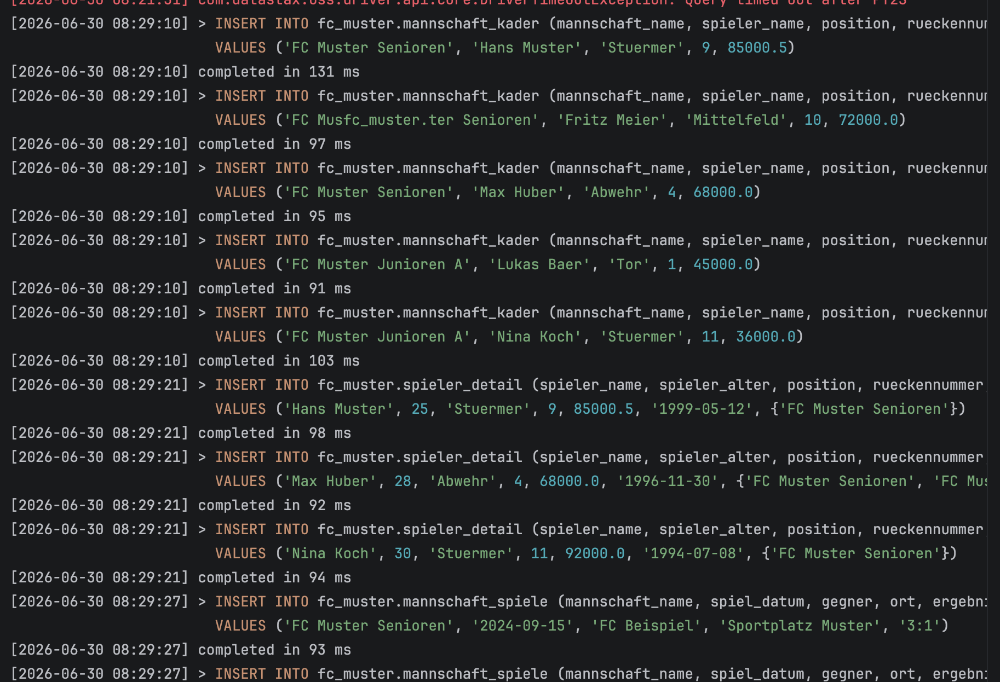
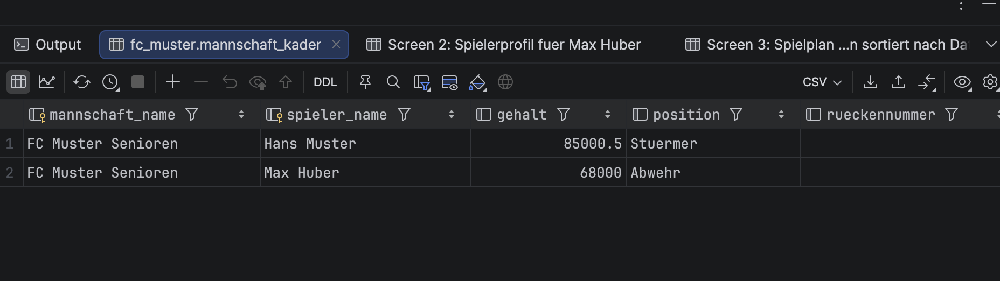
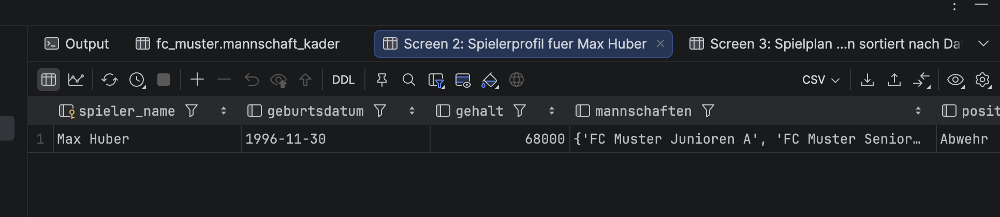
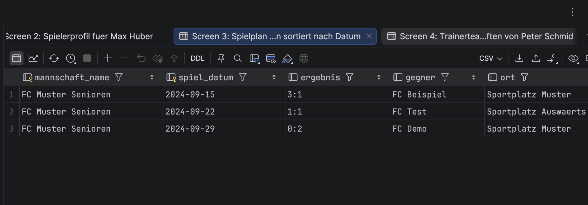
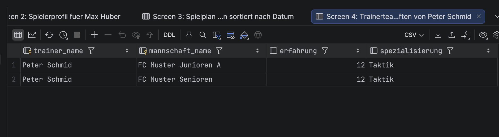
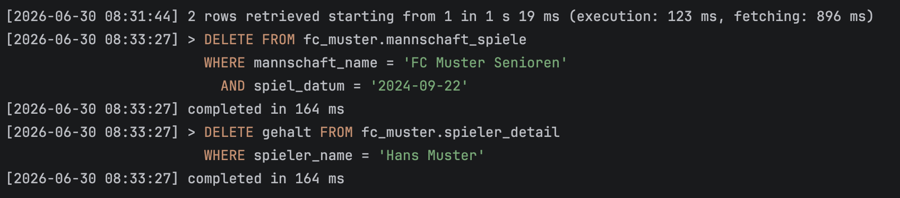
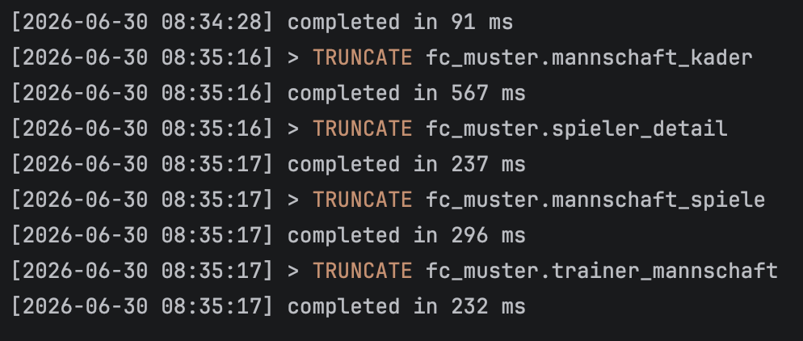
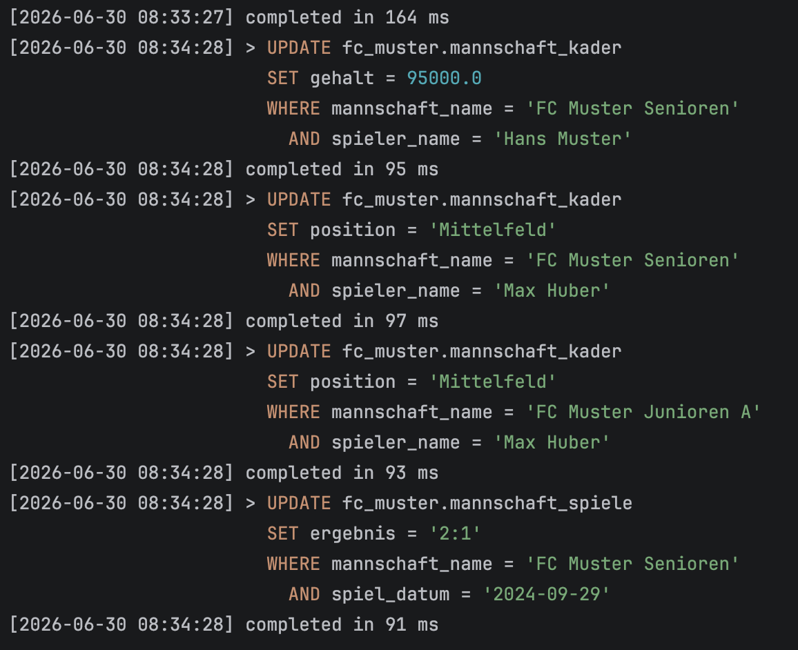

# KN-C-02 - Datenabfrage und -Manipulation

Alles auf dem Keyspace `fc_muster` (gleiches Thema FC Muster). Die Tabellen wurden in KN-C-01 erstellt.

---

## Teil A: Daten hinzufuegen (25%)

Script: `insert-data.cql`

Ich habe fuer jede Tabelle 3-5 Zeilen eingefuegt. Pro Partition-Key habe ich mehrere Datensaetze, damit die Sortierung mit Cluster-Keys Sinn macht.

Screenshot:

---

## Teil B: Daten abfragen (25%)

Script: `queries.cql`

Hier fuehre ich die Abfragen zu den Szenarien aus KN-C-01 aus.

Screenshots:

---

## Teil C: Daten loeschen (25%)

Scripts: `delete-data.cql` und `drop-all.cql`

### Zeilen loeschen mit Partition- und Cluster-Key

### Spalten loeschen

**Kann man Spalten von einzelnen Zeilen loeschen?**  
Ja, mit `DELETE spaltenname FROM tabelle WHERE ...` kann man einzelne Spalten loeschen. Die Zeile bleibt bestehen, aber die Spalte wird auf null gesetzt. Das funktioniert auch mit mehreren Spalten gleichzeitig.

### Alle Daten loeschen

`TRUNCATE` leert die ganze Tabelle, behaelt aber die Struktur. Danach kann man mit `insert-data.cql` die Daten wieder neu einspielen.

---

## Teil D: Daten veraendern (20%)

Script: `update-data.cql`

### Szenario 1: Gehaltserhoehung fuer einen Spieler

Hans Muster hatte eine gute Saison und soll mehr Gehalt bekommen. Bei Cassandra muss der ganze Primaerschluessel in der WHERE-Klausel angegeben werden.

### Szenario 2: Spieler wechselt die Position

Max Huber wechselt von der Abwehr ins Mittelfeld. Da er in zwei Mannschaften spielt, muss ich beide Eintraege aktualisieren.

### Szenario 3: Ergebnis eines Spiels korrigieren

Der FC Muster hat gegen FC Demo doch 2:1 gewonnen (falsch eingetragen).

Screenshots:

