# KN-M-01 - Installation und Verwaltung von MongoDB

## Teil A: Installation

### Cloud-Init

Hab die Cloud-Init Datei (`CloudInit-mongoDB.yaml`) für AWS gebaut. Damit wird eine Ubuntu Instanz mit MongoDB 6.0 aufgesetzt. Der Admin User wird direkt beim ersten Start erstellt.

- **Username:** `admin`
- **Passwort:** `MeinSicheresPasswort.2024` (nur für die Abgabe)

### Was die sed-Befehle machen

**1. `sudo sed -i 's/127.0.0.1/0.0.0.0/g' /etc/mongod.conf`**

MongoDB lauscht standardmässig nur auf localhost (`127.0.0.1`). Wenn man von aussen drauf will (z.B. mit Compass vom Laptop aus), bringt das nichts. Der sed-Befehl ändert die bindIp auf `0.0.0.0`, also alle Netzwerk-Interfaces. Ist notwendig, damit man überhaupt von extern connecten kann.

**2. `sudo sed -i 's/#security:/security:\n  authorization: enabled/g' /etc/mongod.conf`**

Die Security-Einstellung ist in der default Konfiguration auskommentiert (`#security:`). Ohne Authentifizierung kann jeder der die IP kennt auf die DB. Der Befehl aktiviert `authorization: enabled`. Danach müssen sich alle Benutzer anmelden. Der Admin-User wird dann direkt im nächsten Schritt via mongosh erstellt.

Habs dann auf dem Server mit `cat /etc/mongod.conf | grep -E "bindIp|security|authorization"` überprüft. Beide Änderungen waren sichtbar.

### authSource=admin – was bringt das?

Der Connection-String sieht so aus:

```
mongodb://admin:MeinSicheresPasswort.2024@<IP>:27017/?authSource=admin&readPreference=primary&ssl=false
```

Der Parameter `authSource=admin` sagt MongoDB: "Hey, such den User in der admin-Datenbank". Das ist wichtig, weil der User `admin` im Cloud-Init mit `use admin; db.createUser(...)` erstellt wurde. Seine Credentials liegen also in der admin-Datenbank.

Wenn ich `authSource` auf was anderes setze (z.B. `test`), findet MongoDB die Login-Daten nicht und es gibt einen Authentication-Fehler.


Screenshots: 

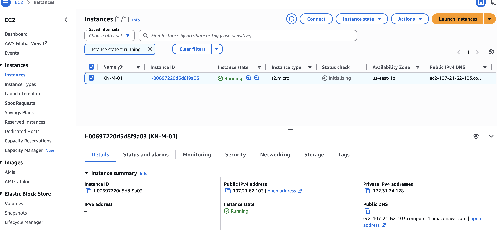
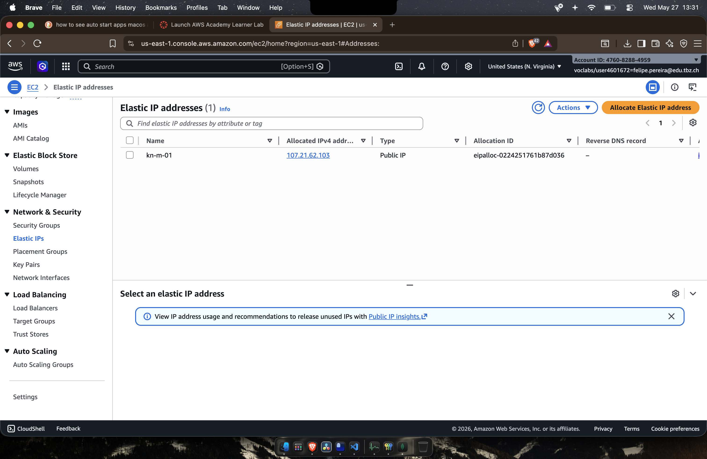
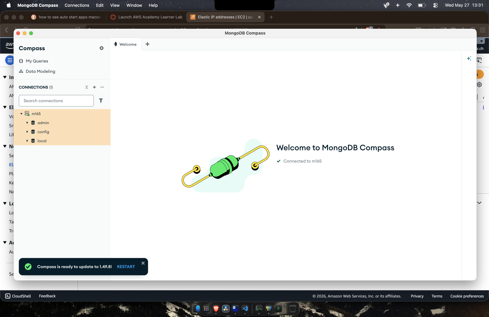
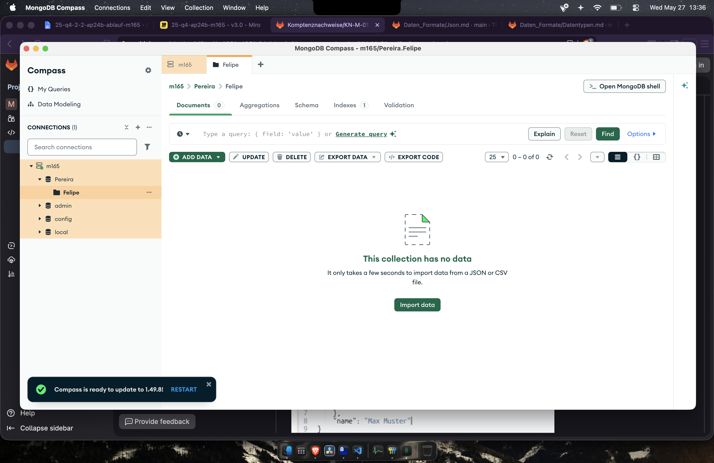
---

## Teil B: Erste Schritte im GUI (Compass)

### DB und Collection anlegen

Hab in Compass eine neue Datenbank erstellt mit:

- **Datenbank:** `[Nachname]`
- **Collection:** `[Vorname]`

### Dokument einfügen

Hab dann ein erstes Dokument eingefügt:

```json
[{
  "_id": {
    "$oid": "6a16d799ad953b20ba04db5a"
  },
  "name": "Felipe Pereira",
  "age": 17,
  "height_cm": 185,
  "gender": "male",
  "address": "Bahnhofstrasse 10, 8001 Zürich",
  "birthdate": {
    "$date": "2008-09-20T00:00:00.000Z"
  }
}]
```

Die `_id` wird automatisch generiert, wenn man nichts angibt. Habs trotzdem mit einem Beispielwert drin gelassen.

### Problem mit dem Datum

Das `geburtsdatum` war nach dem Einfügen als String gespeichert, nicht als Date. In JSON gibt es halt keinen Datums-Typ, das wird immer als String rübergebracht. Musste im Compass-Editor manuell den Datentyp von `string` auf `Date` umstellen.

**Wie macht man es direkt richtig?**
Entweder im Insert-Dialog in Compass das Dropdown von `string` auf `Date` stellen, oder in der Shell so:

```javascript
db.collection.insertOne({
  name: "Hans Muster",
  geburtsdatum: new Date("1990-05-15"),
});
```

Im JSON-Export sieht ein korrektes Datum dann so aus: `{ "$date": "1990-05-15T00:00:00.000Z" }`. Das ist MongoDB Extended JSON. Ohne dieses Format geht die Typinformation verloren.

**Konsequenz:** Das gleiche Problem hat man auch mit anderen speziellen BSON-Typen wie ObjectId, NumberLong oder BinData. JSON kann diese Typen nicht abbilden, drum brauchts die Extended JSON Syntax.


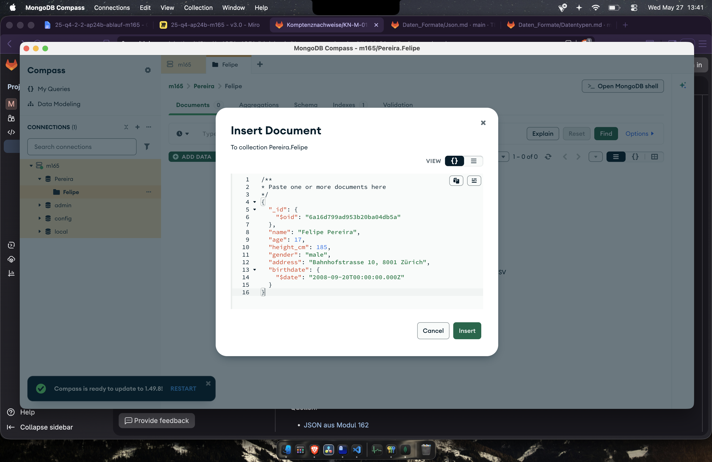
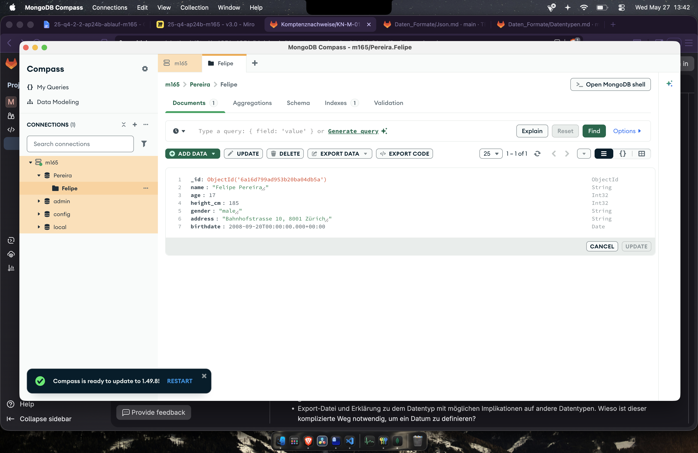

---

## Teil C: Erste Schritte Shell (MONGOSH)

### Befehle in Compass MONGOSH und auf dem Server

Hab die Befehle sowohl in Compass (unten auf MONGOSH klicken) als auch via SSH auf dem AWS Server eingegeben. Auf dem Server mit:

```
sudo mongosh --authenticationDatabase "admin" -u "admin" -p
```

| Befehl                    | Was passiert                                      |
| ------------------------- | ------------------------------------------------- |
| `show dbs;`               | Zeigt alle Datenbanken an                         |
| `show databases;`         | Gleiche wie show dbs                              |
| `use [Name];`             | Wechselt zu einer bestimmten Datenbank            |
| `show collections;`       | Listet Collections in der aktuellen DB            |
| `show tables;`            | Gleiche wie show collections (SQL-Kompatibilität) |
| `var test="hallo"; test;` | Zeigt dass die Shell JavaScript kann              |

### Collections vs. Tables

In SQL-Datenbanken heissen die Dinger **Tables** und haben ein starres Schema (Spalten mit festen Datentypen). In MongoDB heissen sie **Collections** und sind flexibler – jedes Dokument kann anders aussehen. `show tables;` gibts nur als Alias, damit SQL-Leute sich leichter tun.

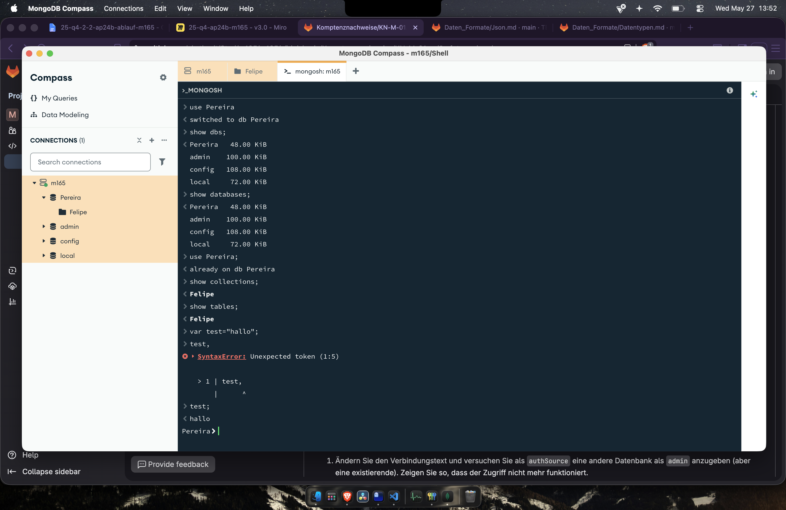
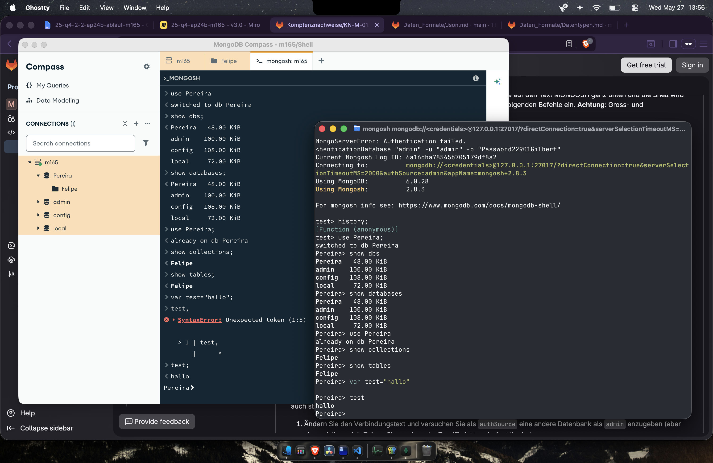

---

## Teil D: Rechte und Rollen

### Falsches authSource zeigt Fehler

Hab ausprobiert ob die authSource Geschichte wirklich stimmt:

```
mongodb://admin:MeinSicheresPasswort.2024@<IP>:27017/?authSource=test&readPreference=primary&ssl=false
```

Resultat: `AuthenticationFailed`. Genau wie erwartet, der User existiert in `test` nicht.

### Benutzer erstellen

Hab zwei Benutzer mit built-in Rollen erstellt (beide ohne "any" im Namen wie verlangt):


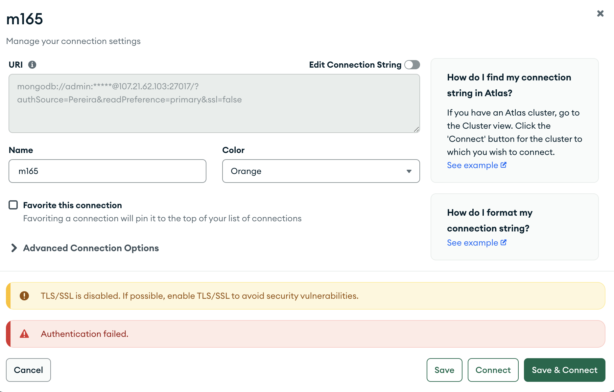
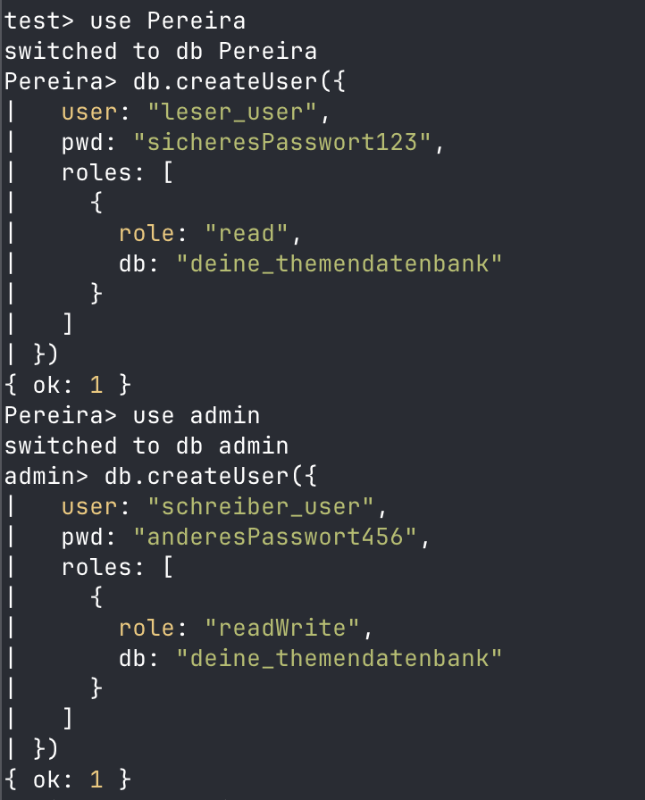
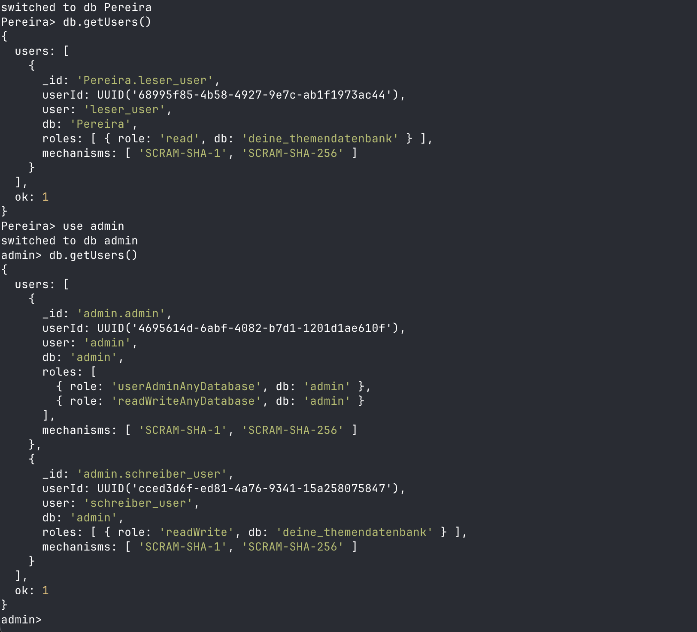