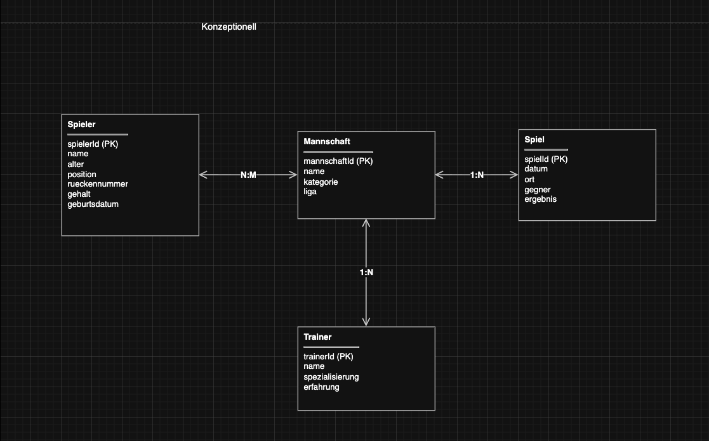
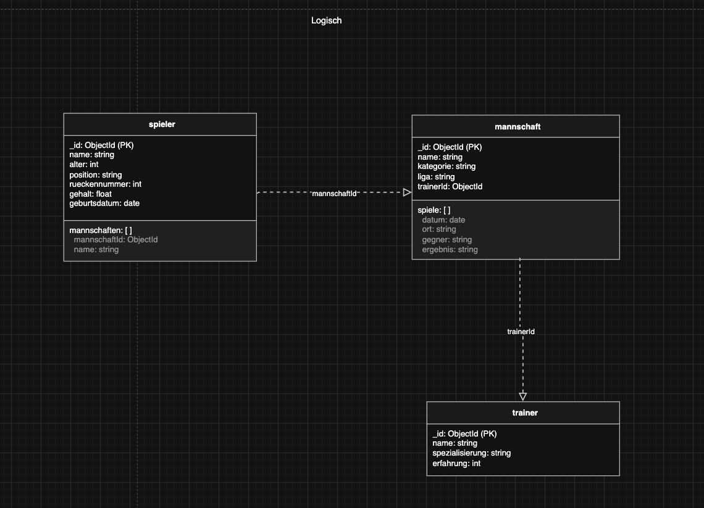
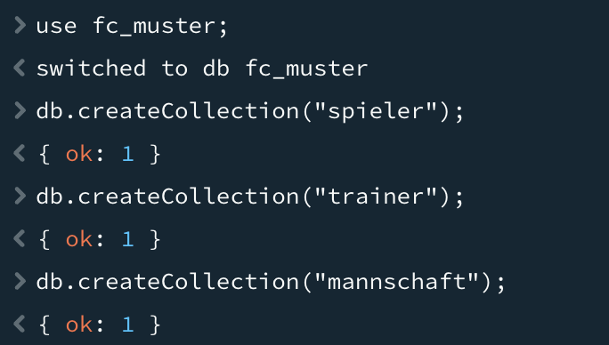
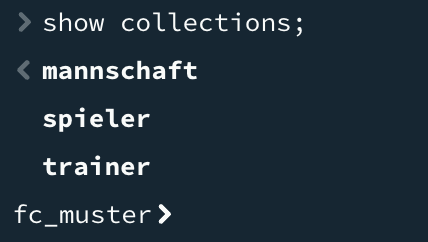
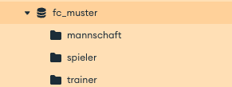

# KN-M-02 - Datenmodellierung für MongoDB

**Thema:** Fussballverein "FC Muster"

---

## Teil A: Konzeptionelles Datenmodell (30%)

Ich hab als Thema den **FC Muster** gewählt – ein fiktiver Fussballverein. Ein Verein bietet sich an, weil es verschiedene Entitäten gibt (Spieler, Mannschaften, Spiele, Trainer) und die Beziehungen klar sind.

### Entitäten

| Entität | Beschreibung |
|---------|-------------|
| **Spieler** | Ein Fussballer im Verein. Hat Name, Alter, Position, Rückennummer, Gehalt und Geburtsdatum. |
| **Mannschaft** | Ein Team innerhalb des Vereins (z.B. Senioren, Junioren A, Junioren B). |
| **Spiel** | Eine Begegnung gegen einen anderen Verein mit Datum, Ort, Gegner und Ergebnis. |
| **Trainer** | Verantwortlicher, der eine oder mehrere Mannschaften trainiert. |

### Beziehungen

**Spieler <> Mannschaft (N:N)**
Ein Spieler kann im Laufe seiner Karriere für verschiedene Mannschaften spielen – z.B. von den Junioren zu den Senioren hochrücken. Eine Mannschaft besteht aus mehreren Spielern (Kader von ca. 18–25 Spielern). Das ist die geforderte **netzwerkförmige Beziehung**.

**Trainer <> Mannschaft (1:N)**
Ein Trainer kann mehrere Mannschaften gleichzeitig betreuen (z.B. U19 + U21). Eine Mannschaft hat genau einen Haupttrainer.

**Mannschaft <> Spiel (1:N)**
Eine Mannschaft bestreitet über die Saison viele Spiele (ca. 15–30). Ein Spiel gehört zu genau einer Mannschaft (Heimmannschaft).

### Bild



*Originalfile: `konzeptionell.drawio`*

---

## Teil B: Logisches Modell für MongoDB (60%)

Aus dem konzeptionellen Modell hab ich dann das logische Modell für MongoDB abgeleitet. Wichtig: MongoDB ist dokumentenorientiert, drum kann ich Beziehungen entweder über **Embedding** (Verschachtelung) oder **Referencing** (Referenzen) abbilden.

### Logisches Modell

**Collection: `spieler`**
```json
{
  "_id": ObjectId,
  "name": "Hans Muster",
  "alter": 25,
  "position": "Stürmer",
  "rueckennummer": 9,
  "gehalt": 85000.50,
  "geburtsdatum": ISODate("1999-05-12T00:00:00Z"),
  "mannschaften": [
    {
      "mannschaftId": ObjectId,
      "name": "FC Muster Senioren"
    }
  ]
}
```

**Collection: `trainer`**
```json
{
  "_id": ObjectId,
  "name": "Peter Schmid",
  "spezialisierung": "Taktik",
  "erfahrung": 12
}
```

**Collection: `mannschaft`**
```json
{
  "_id": ObjectId,
  "name": "FC Muster Senioren",
  "kategorie": "Senioren",
  "liga": "2. Liga",
  "trainerId": ObjectId,
  "spiele": [
    {
      "datum": ISODate("2024-09-15T00:00:00Z"),
      "ort": "Sportplatz Muster",
      "gegner": "FC Beispiel",
      "ergebnis": "3:1"
    }
  ]
}
```

### Verwendete Datentypen

| Datentyp | Beispiel |
|----------|----------|
| **string** | name, position, ort, gegner, ergebnis, liga, spezialisierung |
| **int** | alter, rueckennummer, erfahrung |
| **float** | gehalt |
| **date** | geburtsdatum, datum (bei Spiel) |

Durchschnittlich hat jede Entität ca. 4 Attribute – die Anforderung von mindestens 3 pro Entität ist erfüllt. Alle geforderten Basistypen (int, float, string) sind vertreten, und `date` wird zweimal verwendet.

### Verschachtelung (Embedding)

Ich hab die **Spiele in die Mannschaft eingebettet** (Array von Subdokumenten). Die Überlegung dahinter:

| Aspekt | Bewertung |
|--------|-----------|
| **Zugriffsmuster** | Spiele werden fast immer im Kontext der Mannschaft abgefragt: "Zeig mir alle Spiele der Senioren". Mit Embedding brauchts keinen JOIN. |
| **Grösse** | Pro Saison sind es ca. 15–30 Spiele pro Mannschaft. Das bleibt klein und passt gut ins Dokument (< 16 MB). |
| **Datenintegrität** | Ein Spiel gehört zu genau einer Mannschaft. Es gibt keinen Grund, Spiele isoliert zu betrachten. |
| **Atomicity** | Wenn ich ein Spiel hinzufüge, ist es sofort mit der Mannschaft gespeichert – keine separaten Writes. |

**Was ich nicht gemacht hab (und wieso):**

- **Spieler in Mannschaft embedden**: Wäre auch möglich, aber eine Mannschaft hat 18–25 Spieler. Das ist noch okay, aber Spieler wechseln Teams. Dann müsste ich das Embedded-Dokument in mehreren Mannschaften updaten – Aufwand.
- **Separate Spiel-Collection mit Referenz**: Wäre die "sicherere" Variante, aber dann brauchts für die Anzeige der Spiele einer Mannschaft immer einen Lookup. Da Spiele immer im Kontext der Mannschaft gebraucht werden, ist Embedding effizienter.
- **Mannschaft in Spieler embedden**: Ein Spieler ist selten in mehr als 1–2 Mannschaften gleichzeitig. Das Array ist klein. Hab ich als `mannschaften`-Array im Spieler gelöst – quasi ein "Embedding für die N:N-Beziehung".

**Fazit:** Ich hab einen **hybriden Ansatz** gewählt:
- **1:N (Mannschaft → Spiel)** → Embedding (Spiele-Array in Mannschaft)
- **N:N (Spieler ↔ Mannschaft)** → Embedding von Referenz-Objekten im Spieler

### Bild des logischen Modells



*Originalfile: `logisch.drawio`*

---

## Teil C: Anwendung des Schemas in MongoDB (10%)

### Script

Das Script `create-collections.js` erstellt die Datenbank und die Collections:

```javascript
use fc_muster;

// Collections erstellen
db.createCollection("spieler");
db.createCollection("trainer");
db.createCollection("mannschaft");

// Bestätigung 
print(db.getCollectionNames());
// oder
`show collections`
```


### Beispiel-Screenshot




