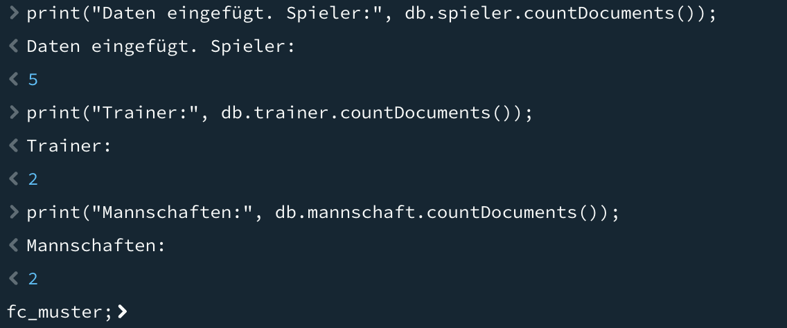
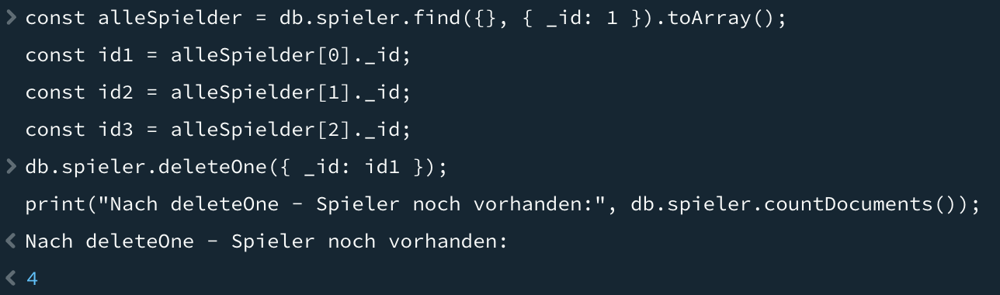
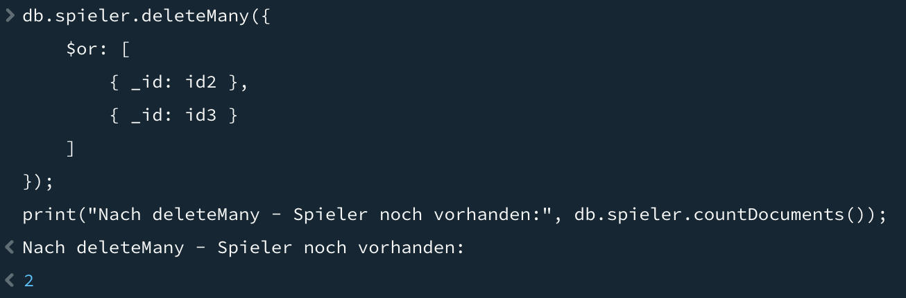
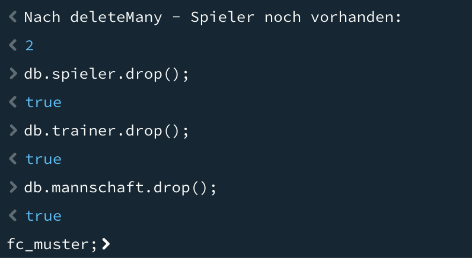
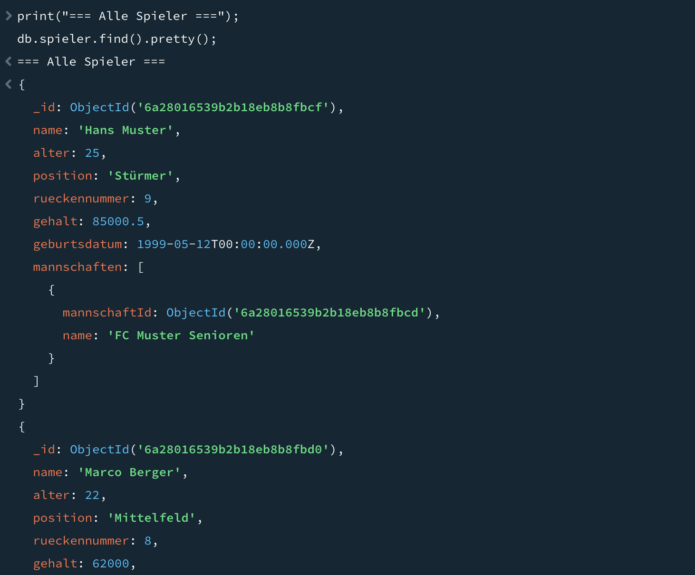
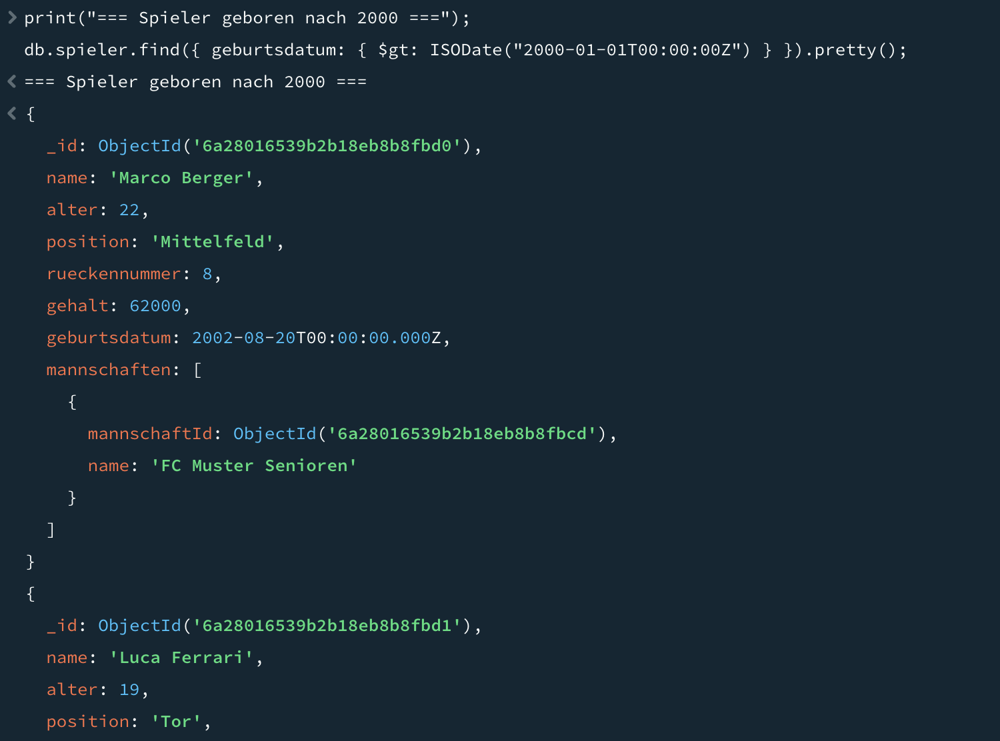
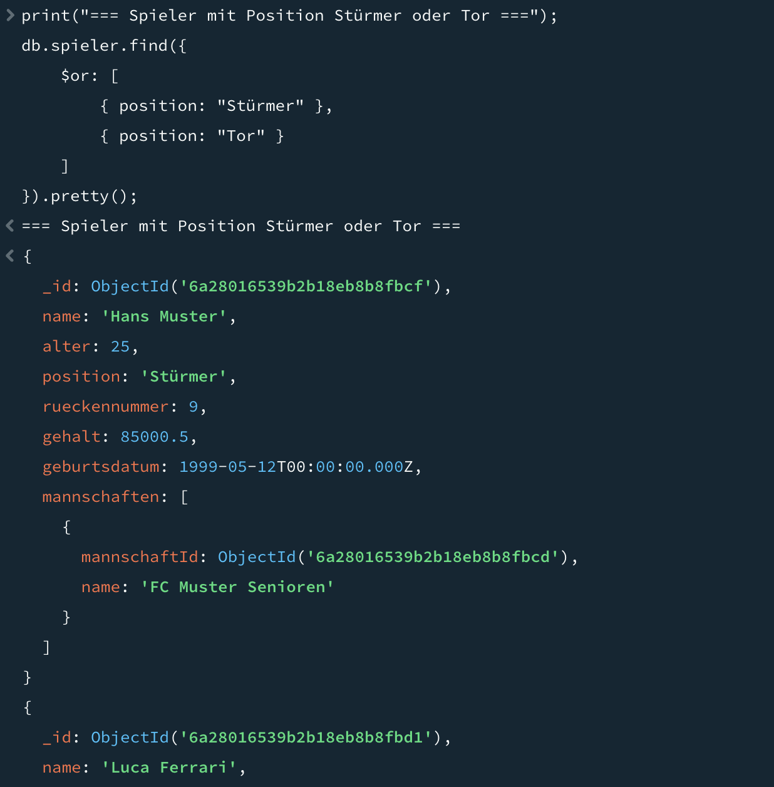
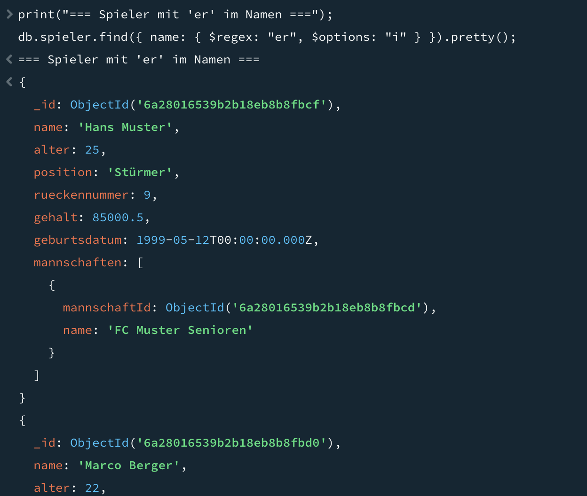

# KN-M-03 - Datenmanipulation und Abfragen I

Hier hab ich CRUD-Operationen auf meiner `fc_muster`-Datenbank gemacht. Alles aufgebaut auf dem Modell aus KN-02.

---

## Teil A: Daten hinzufügen

Script: `insert-data.js`

Hab für alle drei Collections Daten eingefügt. Für `trainer` hab ich `insertOne()` genommen, für `spieler` und `mannschaft` jeweils `insertMany()`. Die `ObjectId`s sind alle als Variablen gesetzt, nichts hardcodiert – so kann man das Script mehrfach ausführen ohne Konflikte (solange man vorher dropped).

Ich hab am Anfang mal probiert die IDs direkt reinzuschreiben, aber dann gibts natürlich Fehler wenn man das Script ein zweites Mal ausführt weil die ID schon existiert. Mit `new ObjectId()` wird jedes Mal eine neue generiert.

```javascript
const spielerId1 = new ObjectId();

db.spieler.insertMany([
  {
    _id: spielerId1,
    name: "Hans Muster",
    alter: 25,
    position: "Stürmer",
    ...
  }
]);
```

Screenshots:




---

## Teil B: Daten löschen

Scripts: `drop-all.js` und `delete-selective.js`

### drop-all.js

Löscht alle drei Collections komplett mit `drop()`. Das brauch ich als "Reset" vor jedem anderen Script:

```javascript
db.spieler.drop();
db.trainer.drop();
db.mannschaft.drop();
```

### delete-selective.js

Hier lösche ich einzeln. Erst ein Spieler mit `deleteOne()` und der `_id` als Filter, dann noch zwei weitere mit `deleteMany()` und einer ODER-Verknüpfung. Wichtig: nicht alle rauslöschen – es müssen noch welche übrig bleiben.

```javascript
// Einen löschen
db.spieler.deleteOne({ _id: id1 });

// Mehrere löschen mit OR, aber nicht alle
db.spieler.deleteMany({
  $or: [{ _id: id2 }, { _id: id3 }]
});
```

Der Unterschied zwischen `drop()` und `deleteMany({})`: `drop()` entfernt die ganze Collection inklusive Indizes, `deleteMany({})` löscht nur die Dokumente aber lässt die Collection (und ihre Indizes) bestehen.

Screenshots:




---

## Teil C: Daten abfragen

Script: `queries.js`

Vorher aufgeräumt mit `drop-all.js` und dann `insert-data.js` ausgeführt.

| Anforderung | Abfrage |
|-------------|---------|
| Pro Collection mindestens 1 | `db.spieler.find()`, `db.mannschaft.find()`, `db.trainer.find()` |
| DateTime-Filter | `geburtsdatum: { $gt: ISODate("2000-01-01") }` |
| ODER (nicht auf _id) | `$or: [{ position: "Stürmer" }, { position: "Tor" }]` auf `spieler` |
| UND (andere Collection als ODER) | `$and: [{ liga: "2. Liga" }, { kategorie: "Senioren" }]` auf `mannschaft` |
| Regex Teilstring | `{ name: { $regex: "er", $options: "i" } }` |
| Projektion mit _id | `find({}, { name: 1, position: 1, _id: 1 })` |
| Projektion ohne _id | `find({}, { name: 1, position: 1, _id: 0 })` |

Beim Regex: `$options: "i"` macht die Suche case-insensitive, also findet "Berger" und "berger" gleichermassen. Ohne das würde nur exakt der gleiche Case gefunden werden.

Screenshots:




---

## Teil D: Daten verändern

Script: `updates.js`

Auch hier zuerst aufgeräumt und neu befüllt.

Die drei Befehle laufen auf unterschiedlichen Collections:

**updateOne() → spieler**  
Mit `_id` als Filter, ändert nur die angegebenen Felder via `$set`:
```javascript
db.spieler.updateOne(
  { _id: spieler._id },
  { $set: { gehalt: 90000.00, alter: 26 } }
);
```

**updateMany() → trainer**  
Ohne `_id`, mit ODER-Verknüpfung. Erhöht die Erfahrung aller Trainer die "Taktik" oder "Kondition" als Spezialisierung haben:
```javascript
db.trainer.updateMany(
  { $or: [{ spezialisierung: "Taktik" }, { spezialisierung: "Kondition" }] },
  { $inc: { erfahrung: 1 } }
);
```

**replaceOne() → mannschaft**  
Ersetzt das komplette Dokument. Nach dem Replace ist alles weg was ich nicht explizit angegeben hab:
```javascript
db.mannschaft.replaceOne(
  { _id: junioren._id },
  { _id: junioren._id, name: "FC Muster Junioren B", ... }
);
```

Unterschied `updateOne` vs `replaceOne`: Bei `updateOne` mit `$set` bleiben alle anderen Felder erhalten, nur die genannten werden geändert. Bei `replaceOne` wird das ganze Dokument ersetzt – was ich nicht mitgebe, ist weg.

Screenshots:



