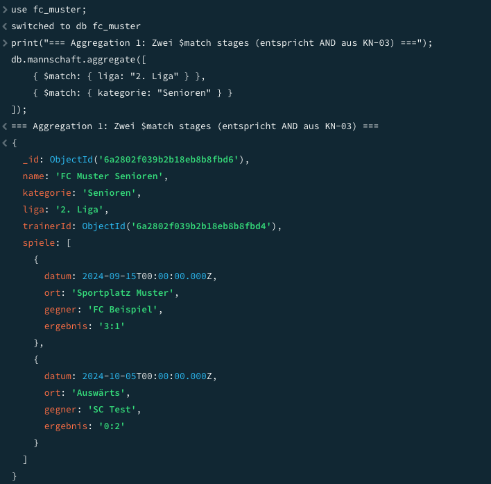
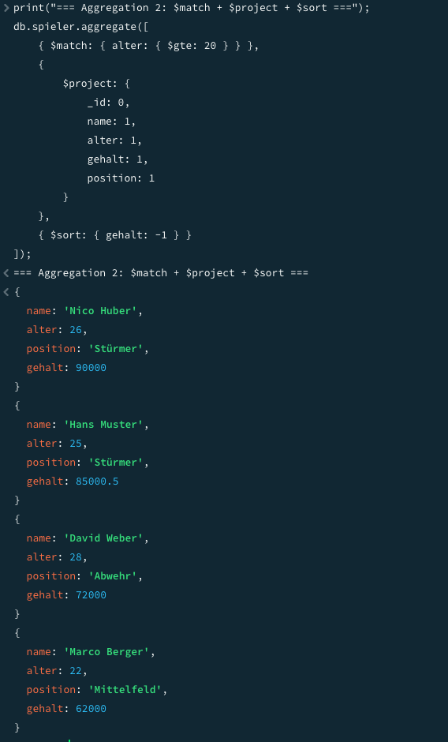
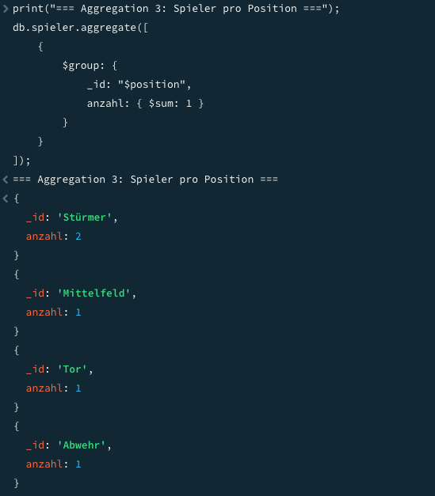
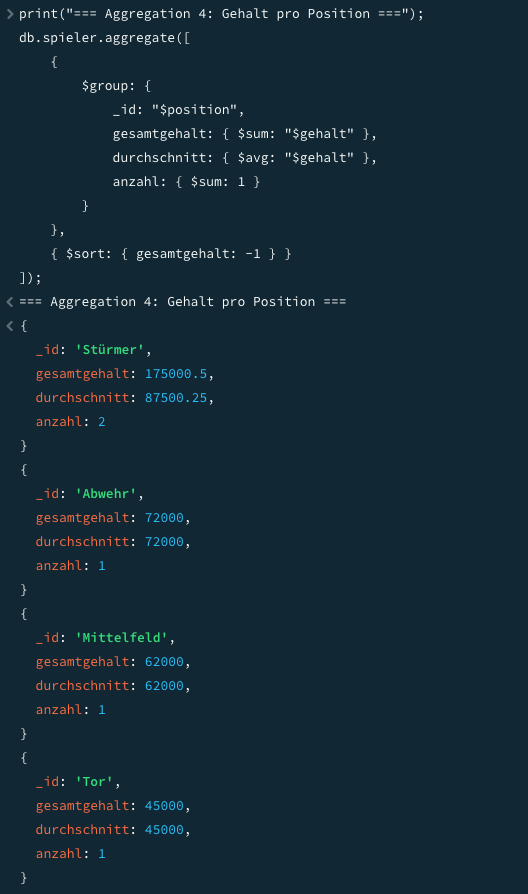
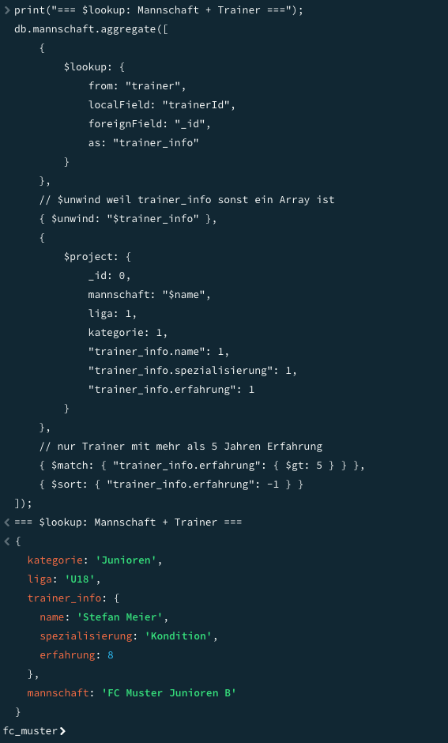
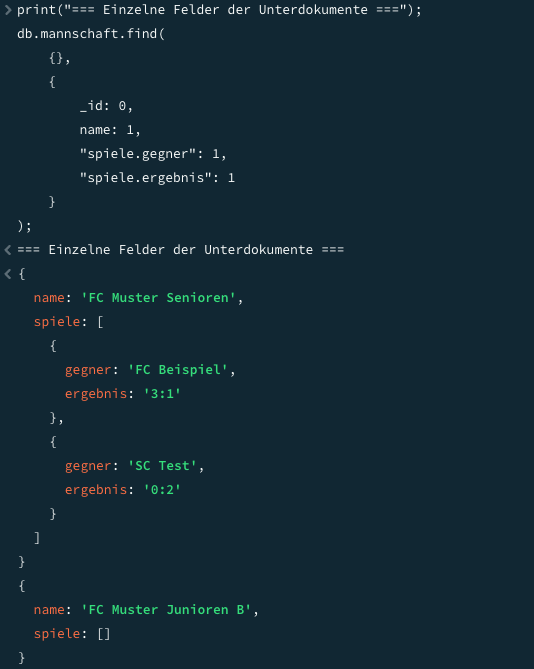

# KN-M-04 - Datenmanipulation und Abfragen II

Fortgeschrittene Abfragen mit Aggregationen, Joins und Unterdokumenten – alles auf der `fc_muster`-Datenbank.

---

## Teil A: Aggregationen

Script: `aggregations.js`

### Aggregation 1 – Das AND aus KN-03 mit $match nachbilden

In KN-03 hatte ich folgendes mit `find()` gemacht:
```javascript
db.mannschaft.find({ $and: [{ liga: "2. Liga" }, { kategorie: "Senioren" }] })
```

Mit Aggregationen macht man das gleiche indem man zwei `$match`-Stages hintereinander schaltet. Jede Stage filtert für sich, und das Ergebnis der ersten geht in die zweite:
```javascript
db.mannschaft.aggregate([
  { $match: { liga: "2. Liga" } },
  { $match: { kategorie: "Senioren" } }
]);
```

### Aggregation 2 – $match + $project + $sort

Spieler ab 20 Jahre, nur bestimmte Felder, nach Gehalt sortiert:
```javascript
db.spieler.aggregate([
  { $match: { alter: { $gte: 20 } } },
  { $project: { _id: 0, name: 1, alter: 1, gehalt: 1, position: 1 } },
  { $sort: { gehalt: -1 } }
]);
```

Gibt mehrere Datensätze zurück (alle Spieler >= 20 Jahre).

### Aggregation 3 – $sum zum Zählen

`$sum: 1` zählt wie viele Dokumente in jede Gruppe fallen:
```javascript
db.spieler.aggregate([
  { $group: { _id: "$position", anzahl: { $sum: 1 } } }
]);
```

### Aggregation 4 – $group auf Feld-Summe

Gesamtgehalt pro Position – hier ist `$sum` nicht 1 sondern ein Feldname:
```javascript
db.spieler.aggregate([
  {
    $group: {
      _id: "$position",
      gesamtgehalt: { $sum: "$gehalt" },
      durchschnitt: { $avg: "$gehalt" }
    }
  },
  { $sort: { gesamtgehalt: -1 } }
]);
```

Der Unterschied zwischen `$sum: 1` und `$sum: "$gehalt"`: ersteres zählt Dokumente, letzteres summiert den Wert des Feldes.

Screenshots:




---

## Teil B: Join mit $lookup

Script: `lookup.js`

`$lookup` verbindet zwei Collections – ähnlich wie ein SQL JOIN. Man gibt an welches Feld aus der aktuellen Collection (`localField`) auf welches Feld in der anderen Collection (`foreignField`) zeigt.

```javascript
db.mannschaft.aggregate([
  {
    $lookup: {
      from: "trainer",
      localField: "trainerId",
      foreignField: "_id",
      as: "trainer_info"
    }
  },
  { $unwind: "$trainer_info" },
  {
    $project: {
      _id: 0,
      mannschaft: "$name",
      "trainer_info.name": 1,
      "trainer_info.erfahrung": 1
    }
  },
  { $match: { "trainer_info.erfahrung": { $gt: 5 } } }
]);
```

Das `$unwind` nach dem `$lookup` ist wichtig: ohne es ist `trainer_info` ein Array (auch wenn nur ein Element drin ist). Mit `$unwind` wird es zu einem einzelnen Objekt und man kann direkt auf `trainer_info.name` zugreifen.

Im Resultat sind Felder aus beiden Collections sichtbar – der Mannschaftsname und die Trainer-Infos.

Screenshots:




---

## Teil C: Unterdokumente / Arrays

Script: `subdocuments.js`

Die `mannschaft`-Collection hat ein `spiele`-Array (Unterdokumente). Darauf kann man mit Dot-Notation zugreifen.

### Abfrage 1 – Einzelne Felder der Unterdokumente ausgeben

Ich will nicht das ganze Array, nur Gegner und Ergebnis:
```javascript
db.mannschaft.find(
  {},
  { name: 1, "spiele.gegner": 1, "spiele.ergebnis": 1, _id: 0 }
);
```

### Abfrage 2 – Nach Unterdokument-Feld filtern

Alle Mannschaften die mindestens ein Spiel mit Ergebnis "3:1" haben:
```javascript
db.mannschaft.find(
  { "spiele.ergebnis": "3:1" },
  { name: 1, "spiele.$": 1, _id: 0 }
);
```

### Abfrage 3 – $unwind zum Verflachen

Das ist das Interessanteste: `$unwind` macht aus einem Dokument mit einem Array mehrere Dokumente – eines pro Array-Element. So kann ich alle Spiele aller Mannschaften zusammen sortieren:

```javascript
db.mannschaft.aggregate([
  { $unwind: "$spiele" },
  {
    $project: {
      _id: 0,
      mannschaft: "$name",
      gegner: "$spiele.gegner",
      ergebnis: "$spiele.ergebnis",
      datum: "$spiele.datum"
    }
  },
  { $sort: { datum: 1 } }
]);
```

Vor `$unwind`: 2 Mannschaftsdokumente (mit je mehreren Spielen).  
Nach `$unwind`: ein Dokument pro Spiel.

Screenshots:



