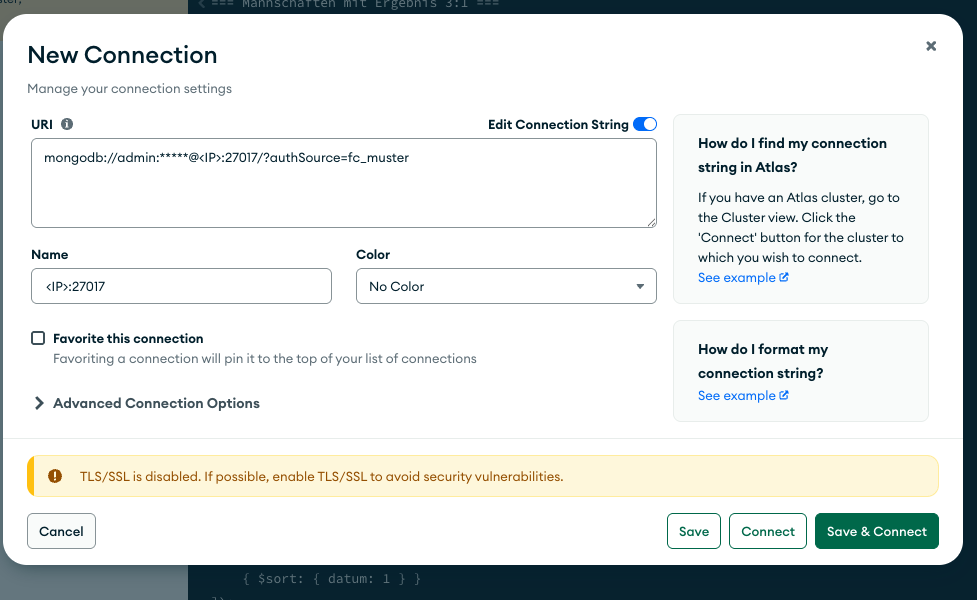
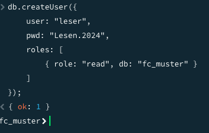
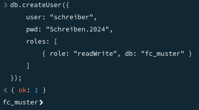
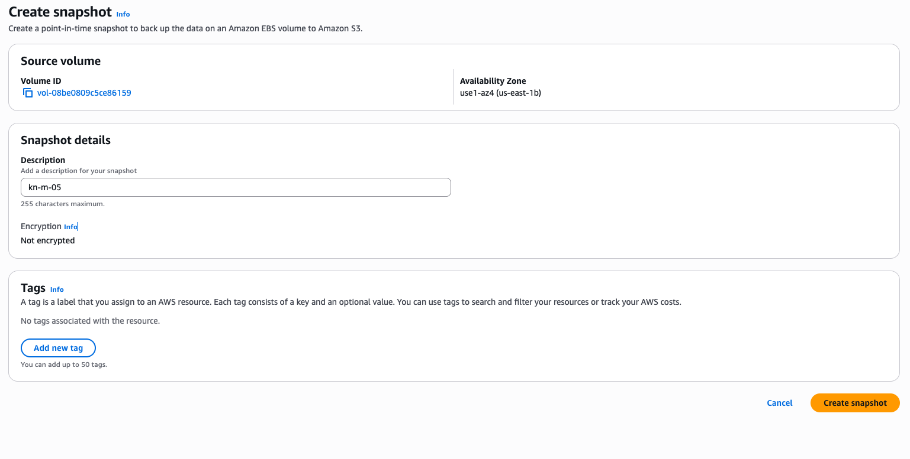
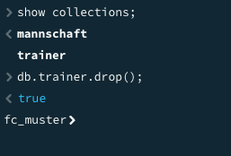
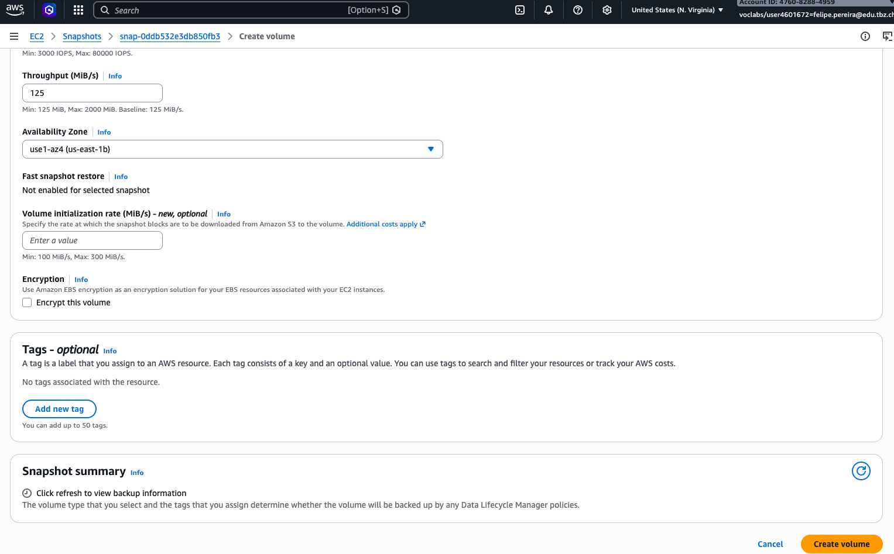
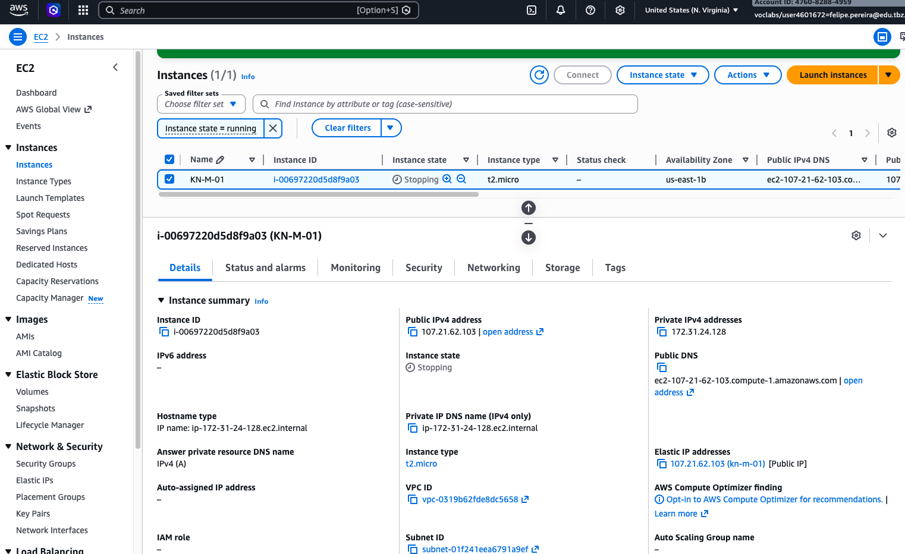
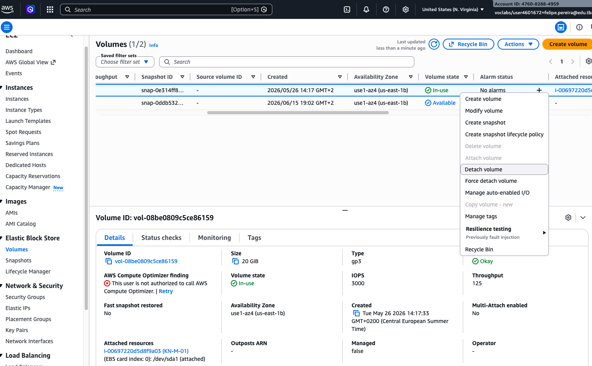
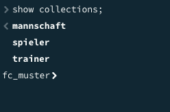

# KN-M-05 - Administration von MongoDB

---

## Teil A: Rechte und Rollen

Script: `create-users.js`

### Falsches authSource → Verbindung schlägt fehl

Hab den Verbindungstext angepasst und `authSource=fc_muster` statt `authSource=admin` angegeben. Der `admin`-User liegt in der `admin`-Datenbank – sucht MongoDB ihn in `fc_muster`, findet er ihn nicht und wirft einen Authentication-Fehler.

Verbindungstext der fehlschlägt:
```
mongodb://admin:MeinSicheresPasswort.2024@<IP>:27017/?authSource=fc_muster&readPreference=primary&ssl=false
```




### Benutzer 1 – Nur lesen (authSource = fc_muster)

```javascript
use fc_muster;
db.createUser({
  user: "leser",
  pwd: "Lesen.2024",
  roles: [{ role: "read", db: "fc_muster" }]
});
```

Verbindungstext: `mongodb://leser:Lesen.2024@<IP>:27017/fc_muster?authSource=fc_muster`


Screenshots:



### Benutzer 2 – Lesen und Schreiben (authSource = admin)

```javascript
use admin;
db.createUser({
  user: "schreiber",
  pwd: "Schreiben.2024",
  roles: [{ role: "readWrite", db: "fc_muster" }]
});
```

Verbindungstext: `mongodb://schreiber:Schreiben.2024@<IP>:27017/fc_muster?authSource=admin`

Screenshots:



**Warum keine "Any"-Rollen?** Rollen wie `readAnyDatabase` geben Zugriff auf alle Datenbanken im System. Das wäre für unsere User viel zu viel – die sollen nur auf `fc_muster` zugreifen können, nicht auf `admin`, `local` oder irgendwelche anderen DBs.

---

## Teil B: Backup und Restore

### Variante 1: AWS EBS Snapshot

**Schritt 1 – Snapshot erstellen:**

AWS Console → EC2 → Volumes → Volume der MongoDB-Instanz auswählen → Actions → Create Snapshot







**Schritt 2 – Daten löschen:**

In MONGOSH eine Collection gelöscht um zu testen:
```javascript
use fc_muster;
db.spieler.drop();
```



**Schritt 3 – Volume aus Snapshot wiederherstellen:**

1. Snapshots → Snapshot auswählen → Actions → Create Volume
2. Availability Zone muss dieselbe sein wie die EC2-Instanz (z.B. `eu-central-1a`) – sonst kann man das Volume nicht attachen!
3. Instanz stoppen → altes Volume detachen → neues Volume als `/dev/sda1` attachen → Instanz starten

Nach dem Neustart: `db.spieler.find()` gibt wieder alle Daten zurück.



---

## Teil C: Skalierung

### Replikation vs. Sharding

**Replikation (Replica Set)**

Bei der Replikation speichern mehrere Server **die gleichen Daten**. Es gibt einen Primary (der schreibt und liest) und ein oder mehrere Secondaries (die synchron bleiben und beim Ausfall des Primary übernehmen können).

```
[Client]
   ↓
[Primary] ──sync──→ [Secondary 1]
           ──sync──→ [Secondary 2]
```

- Ziel: Hochverfügbarkeit, kein Single Point of Failure
- Lese-Skalierung möglich (Reads auf Secondaries verteilen)
- Datenmenge bleibt gleich auf jedem Node

**Sharding (Partitionierung)**

Beim Sharding werden die Daten **aufgeteilt** auf mehrere Server. Jeder Shard enthält nur einen Teil. Ein Router (mongos) leitet Anfragen an den richtigen Shard weiter.

```
[Client]
   ↓
[mongos Router]
   ↓         ↓
[Shard 1]  [Shard 2]
(User A-M) (User N-Z)
```

- Ziel: Horizontale Skalierung bei riesigen Datenmengen
- Datenmenge wächst → einfach neue Shards hinzufügen
- Komplexer in der Verwaltung, Shard-Key muss gut gewählt werden

**Quellen:**
- https://www.mongodb.com/basics/scaling
- https://www.mongodb.com/docs/manual/replication/
- https://www.mongodb.com/docs/manual/sharding/

### Empfehlung für unsere Firma

Bei uns in der Firma wird MongoDB für eine interne Projektmanagement-Applikation eingesetzt. Die Datenmenge ist überschaubar (einige Tausend Projekte, Mitarbeiter, Tasks), wächst aber jährlich ca. 20%.

**Empfehlung: Replica Set mit 3 Nodes**

Sharding macht bei uns keinen Sinn. Wir haben keine Datenmengen die ein einzelner Server nicht verarbeiten könnte. Was uns aber wichtig ist: Die Applikation darf nicht ausfallen. Ein Replica Set mit 3 Nodes gibt uns:

- Automatisches Failover wenn ein Node ausfällt
- Möglichkeit Reads auf Secondaries zu verteilen für bessere Performance
- Backup-Möglichkeit durch Snapshot eines Secondaries ohne den Primary zu belasten

Wenn die Datenmenge irgendwann wirklich ein Problem wird (mehrere hundert GB), kann man Sharding nachträglich einführen. Aber für jetzt ist Replikation die richtige Wahl.
