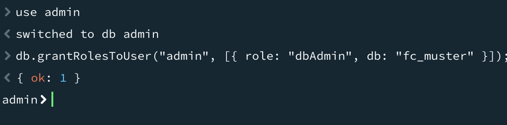
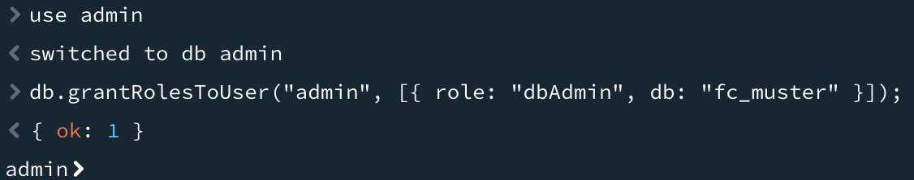
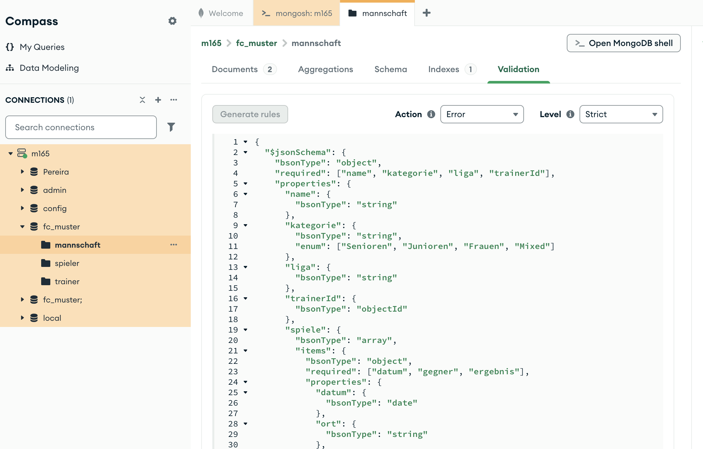
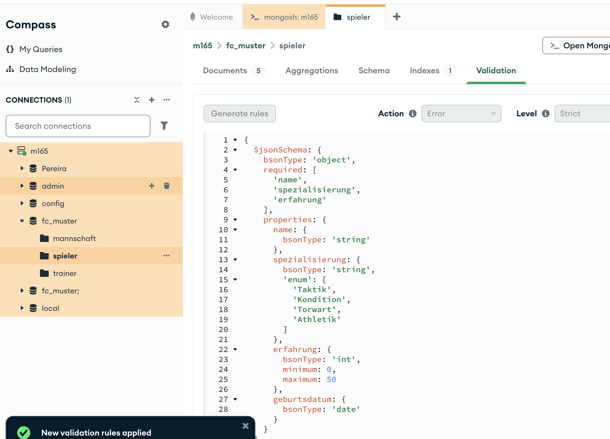
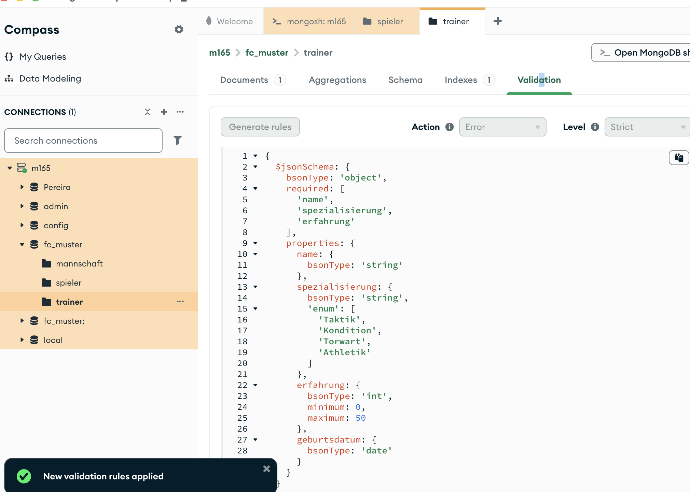

# KN-M-06 - JSON Schema und Collection Validierung

Hab für alle drei Collections der `fc_muster`-Datenbank JSON Schemas erstellt und dann als Validierung in MongoDB hinterlegt.

---

## Teil A: JSON Schemas erstellen

Files:
- `spieler-example.json` / `spieler-schema.json`
- `trainer-example.json` / `trainer-schema.json`
- `mannschaft-example.json` / `mannschaft-schema.json`

Ich hab zuerst je ein Beispieldokument pro Collection erstellt (Extended JSON Format, also `$oid`, `$date` etc.) und danach das Schema dazu geschrieben. Dabei hat mir der Compass Schema-Analyzer geholfen – der zeigt einem die Typen der bestehenden Felder an.

**Wichtig: MongoDB verwendet `bsonType` statt `type`**

In normalem JSON Schema schreibt man `"type": "string"`. MongoDB hat aber eigene Datentypen die JSON nicht kennt – z.B. `date`, `objectId` oder `int` vs `double`. Deshalb muss man `bsonType` verwenden:

| JSON Schema | MongoDB bsonType |
|-------------|-----------------|
| `"type": "string"` | `"bsonType": "string"` |
| `"type": "number"` | `"bsonType": "int"` oder `"bsonType": "double"` |
| `"type": "object"` | `"bsonType": "object"` |
| nicht vorhanden | `"bsonType": "date"` |
| nicht vorhanden | `"bsonType": "objectId"` |

### Pflichtfelder und Einschränkungen

Bei `spieler` hab ich z.B. definiert:
- `alter`: muss zwischen 15 und 45 liegen (`minimum`, `maximum`)
- `position`: nur erlaubte Werte (`enum`)
- `mannschaften`: Array von Objekten mit eigenem Schema

```json
{
  "$jsonSchema": {
    "bsonType": "object",
    "required": ["name", "alter", "position", "rueckennummer", "gehalt", "geburtsdatum"],
    "properties": {
      "position": {
        "bsonType": "string",
        "enum": ["Tor", "Abwehr", "Mittelfeld", "Stürmer"]
      },
      "alter": {
        "bsonType": "int",
        "minimum": 15,
        "maximum": 45
      }
    }
  }
}
```







---

## Teil B: Validierung hinterlegen und testen

Script: `validation.js`

### Neue Rolle vergeben

Damit man `collMod` ausführen kann (Befehl zum Hinzufügen von Validierungen), braucht man die `dbAdmin`-Rolle:

```javascript
use admin;
db.grantRolesToUser("admin", [{ role: "dbAdmin", db: "fc_muster" }]);
```

### Validierung via Compass (UI) – mannschaft

Die Validierung für `mannschaft` hab ich via Compass eingerichtet. In Compass: Collection anklicken → drei Punkte → **Validation** → Schema reinkopieren → **Update**.


### Validierung via mongosh – spieler und trainer

Die anderen zwei Collections hab ich per Befehl gemacht:

```javascript
db.runCommand({
  collMod: "spieler",
  validator: { $jsonSchema: { ... } },
  validationLevel: "strict",
  validationAction: "error"
});
```

- `validationLevel: "strict"` – alle Inserts und Updates werden validiert
- `validationAction: "error"` – bei Verstoss wird ein Fehler geworfen (Alternative wäre `warn`, das nur loggt aber trotzdem einfügt)


### Bestehende Validierung auslesen

```javascript
db.getCollectionInfos({ name: "spieler" })[0].options.validator
```

Das gibt das hinterlegte Schema aus.


### Test: Gültiges Dokument ✅

```javascript
db.spieler.insertOne({
  name: "Test Spieler",
  alter: NumberInt(23),
  position: "Abwehr",
  rueckennummer: NumberInt(5),
  gehalt: 55000.50,
  geburtsdatum: ISODate("2001-03-10T00:00:00Z")
});
```

Eingefügt ohne Fehler.


### Test: Ungültiges Dokument ❌

```javascript
db.spieler.insertOne({
  name: "Falscher Spieler",
  alter: 10,
  position: "Torwart",
  rueckennummer: 0,
  gehalt: -500.0,
  geburtsdatum: ISODate("2014-01-01T00:00:00Z")
});
```

Fehler: `Document failed validation`

- `alter: 10` → unter dem Minimum von 15
- `position: "Torwart"` → nicht im Enum (erlaubt wäre "Tor")
- `rueckennummer: 0` → Minimum ist 1
- `gehalt: -500` → Minimum ist 0


