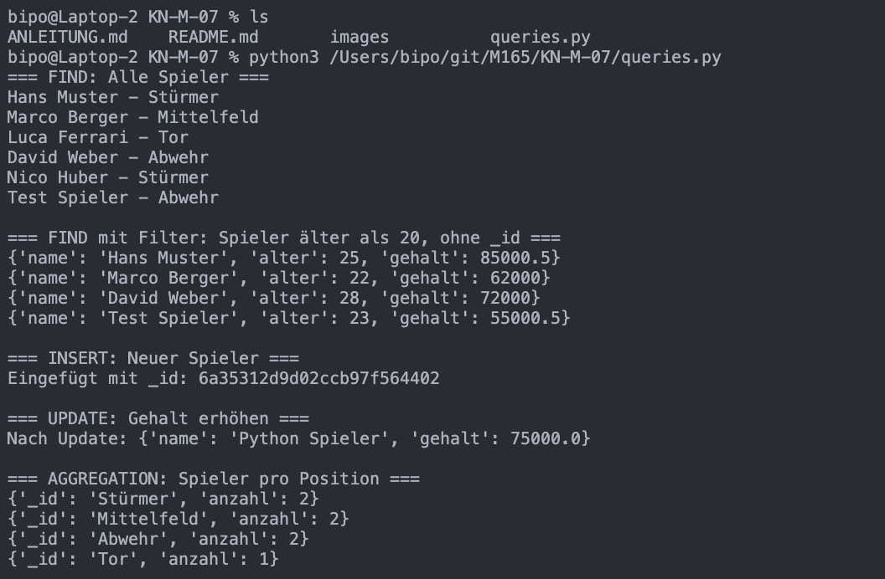
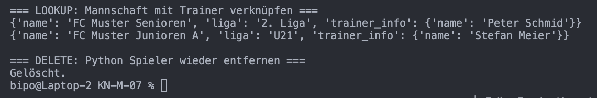

# KN-M-07 - Programmierung mit MongoDB

Hab Python mit `pymongo` gewählt um auf die AWS-Datenbank zuzugreifen. Script: `queries.py`

---

## Setup

```bash
pip install pymongo
```

Verbindung zur AWS-Instanz:

```python
from pymongo import MongoClient

client = MongoClient(
    "mongodb://admin:MeinSicheresPasswort.2024@<AWS-IP>:27017/?authSource=admin"
)
db = client["fc_muster"]
```

Ist eigentlich gleich aufgebaut wie der Verbindungstext in Compass – dieselben Parameter, nur in Python-Syntax.

---

## Abfragen aus früheren KNs

### find() – alle Spieler

```python
for s in db.spieler.find():
    print(s["name"], "-", s["position"])
```

### find() mit Filter und Projektion (aus KN-03 Teil C)

```python
result = db.spieler.find(
    {"alter": {"$gt": 20}},
    {"name": 1, "alter": 1, "gehalt": 1, "_id": 0}
)
for r in result:
    print(r)
```

### insertOne()

```python
from datetime import datetime

result = db.spieler.insert_one({
    "name": "Python Spieler",
    "alter": 24,
    "position": "Mittelfeld",
    "rueckennummer": 14,
    "gehalt": 70000.0,
    "geburtsdatum": datetime(2000, 6, 15)
})
print("Eingefügt mit _id:", result.inserted_id)
```

Datum muss als Python `datetime`-Objekt übergeben werden – das entspricht dann ISODate in MongoDB.

### updateOne()

```python
db.spieler.update_one(
    {"name": "Python Spieler"},
    {"$set": {"gehalt": 75000.0}}
)
```

### deleteOne()

```python
db.spieler.delete_one({"name": "Python Spieler"})
```

### Aggregation aus KN-04

```python
pipeline = [
    {"$group": {"_id": "$position", "anzahl": {"$sum": 1}}},
    {"$sort": {"anzahl": -1}}
]
for r in db.spieler.aggregate(pipeline):
    print(r)
```

Die Pipeline ist einfach eine Python-Liste mit Dictionaries – genau die gleiche Struktur wie in mongosh, nur in Python-Syntax.

### $lookup aus KN-04

```python
pipeline = [
    {
        "$lookup": {
            "from": "trainer",
            "localField": "trainerId",
            "foreignField": "_id",
            "as": "trainer_info"
        }
    },
    {"$unwind": "$trainer_info"},
    {"$project": {"_id": 0, "name": 1, "trainer_info.name": 1}}
]
for r in db.mannschaft.aggregate(pipeline):
    print(r)
```

Screenshots:




