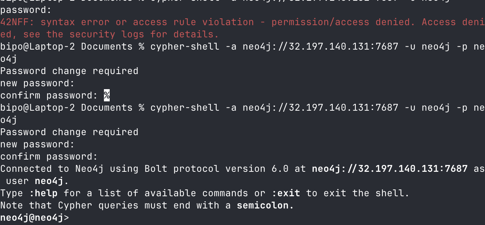
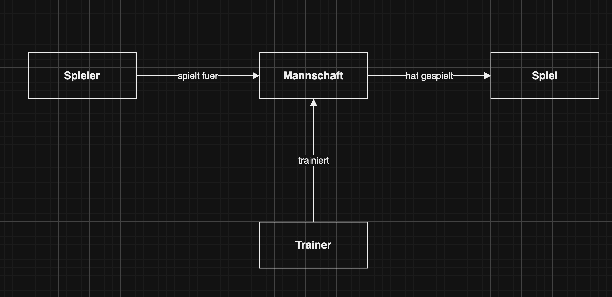

# KN-N-01 - Installation und Datenmodellierung fuer Neo4j

**Thema:** Fussballverein "FC Muster" (gleich wie bei den MongoDB Aufgaben)

---

## Teil A: Installation / Account erstellen (30%)

### Variante: AWS mit Cloud-Init

Ich habe mich fuer die AWS Variante entschieden, weil ich den Server schon fuer die MongoDB Aufgaben bereit hatte.

**Cloud-Init Datei:** `CloudInit-neo4j.yaml`

Damit wird eine Ubuntu 24.04 Instanz mit Neo4j aufgesetzt. Der Installationsprozess:

1. Neo4j GPG-Key importieren
2. Neo4j Repository zu apt hinzufuegen
3. neo4j Package installieren
4. Service enabled und starten
5. `sed` Befehl zum Freigeben des Netzwerks (aendert `#server.default_listen_address` auf `server.default_listen_address`)
6. Service neustarten

**Standard-Login:** `neo4j` / `neo4j` (muss beim ersten Login geaendert werden)

### Verbindung testen

Nach der Installation habe ich mich via cypher-shell verbunden:

```bash
cypher-shell -a neo4j://<IP>:7687 -u neo4j -p
```

Hat funktioniert, Passwort wurde geaendert.

Screenshot:



---

## Teil B: Logisches Modell fuer Neo4j (70%)

### Konzeptionelles Modell

Gleich wie bei den MongoDB Aufgaben: **FC Muster** mit 4 Entitaeten:

| Entitaet | Beschreibung |
|---------|-------------|
| **Spieler** | Fussballer im Verein mit Name, Alter, Position, Rueckennummer, Gehalt, Geburtsdatum |
| **Mannschaft** | Team innerhalb des Vereins (z.B. Senioren, Junioren) |
| **Spiel** | Ein Match gegen einen anderen Verein |
| **Trainer** | Verantwortlicher fuer eine oder mehrere Mannschaften |

### Logisches Modell fuer Neo4j

Im Gegensatz zu MongoDB, wo man mit Dokumenten und Verschachtelungen arbeitet, habe ich bei Neo4j einen reinen Graph:

**Knoten (Labels):**

```
(:Spieler {name, alter, position, rueckennummer, gehalt, geburtsdatum})
(:Mannschaft {name, kategorie, liga})
(:Spiel {datum, ort, gegner, ergebnis})
(:Trainer {name, spezialisierung, erfahrung})
```

**Kante mit Attribut:**

```
(:Spieler)-[:SPIELT_FUER {seit: 2022}]->(:Mannschaft)
```

Die Kante `SPIELT_FUER` hat ein Attribut `seit` (Join-Jahr des Spielers in die Mannschaft). Das ist ein klassischer Fall, wo ein Attribut auf der Kante Sinn macht - es gehoert zur Beziehung, nicht zum Spieler oder zur Mannschaft einzeln.

**Weitere Kanten:**

```
(:Trainer)-[:TRAINIERT]->(:Mannschaft)
(:Mannschaft)-[:HAT_GESPIELT]->(:Spiel)
```

### Grafische Darstellung



*Originalfile: `logisch.drawio`*

### Erklaerung zu den Attributen auf den Kanten

**`SPIELT_FUER {seit: 2022}`**

Ich habe `seit` auf die Kante gelegt, nicht auf den Spieler oder die Mannschaft. Grund: Ein Spieler kann im Laufe seiner Karriere in verschiedenen Mannschaften gespielt haben (z.B. von den Junioren zu den Senioren aufsteigen). Wenn `seit` (das Beitrittsjahr) ein Attribut des Spielers waere, koennte man nicht mehrere Beitritte zu verschiedenen Mannschaften abbilden. Und auf der Mannschaft hat es auch keinen Sinn, weil die Mannschaft immer wieder neue Spieler bekommt. Darum ist das Attribut auf der Kante - es beschreibt genau die konkrete Beziehung zwischen diesem Spieler und dieser Mannschaft.
