# KN-N-02 - Datenabfrage und -Manipulation

Alles auf der `fc_muster`-Graphdatenbank (gleiches Thema wie bei den MongoDB Aufgaben: FC Muster).

---

## Teil A: Daten hinzufuegen (20%)

Script: `insert-data.cypher`

Ich habe eine sinnvolle Menge an Knoten und Kanten eingefuegt - etwa 3-5 Objekte pro Label.

Ich habe ein einziges grosses CREATE-Statement verwendet, weil Neo4j das erlaubt und es so am effizientesten ist:

Screenshot:

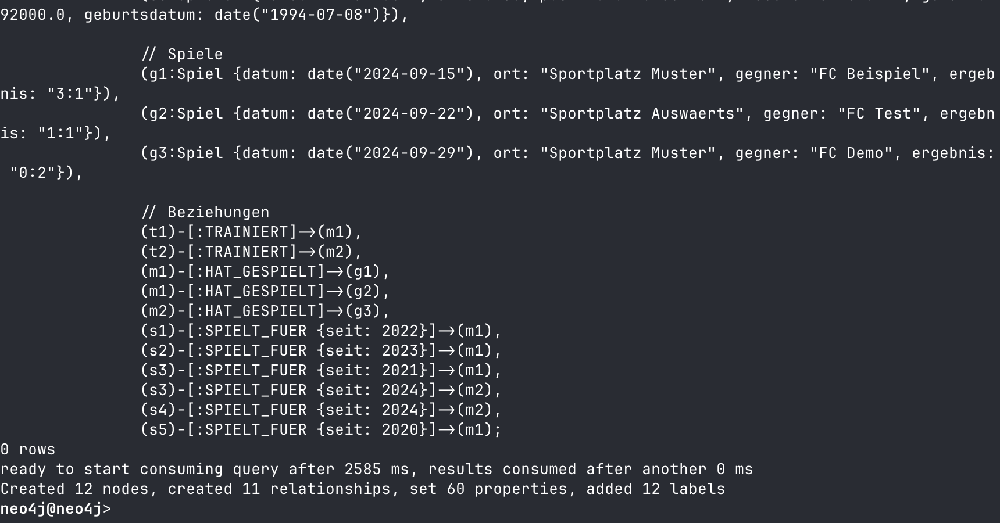

---

## Teil B: Daten abfragen (20%)

### Erklaerung des Standard-Statements

- `MATCH (n)` - Findet **alle** Knoten in der Datenbank und gibt ihnen die Variable `n`.
- `OPTIONAL MATCH (n)-[r]->(m)` - Versucht zu jedem Knoten `n` ausgehende Beziehungen (`[r]`) zu anderen Knoten (`m`) zu finden. `OPTIONAL` bedeutet: wenn ein Knoten **keine** Beziehungen hat, wird er trotzdem im Resultat gezeigt (mit `null` fuer `r` und `m`). Ohne `OPTIONAL` wuerden Knoten ohne Beziehungen herausgefiltert.
- `RETURN n, r, m` - Gibt alle Knoten, Beziehungen und Ziel-Knoten zurueck.

Darum ist `OPTIONAL` wichtig: sonst wuerde man zum Beispiel einen einsamen Knoten (ohne Beziehungen) nicht sehen, weil der `MATCH (n)-[r]->(m)` nichts findet und der ganze `n` aus der Auswahl fliegt.

### 4 Szenarien

**Szenario 1: Alle Spieler der Senioren-Mannschaft**

Wer spielt aktuell fuer die Senioren? Das ist relevant fuer die Aufstellung der naechsten Saison.
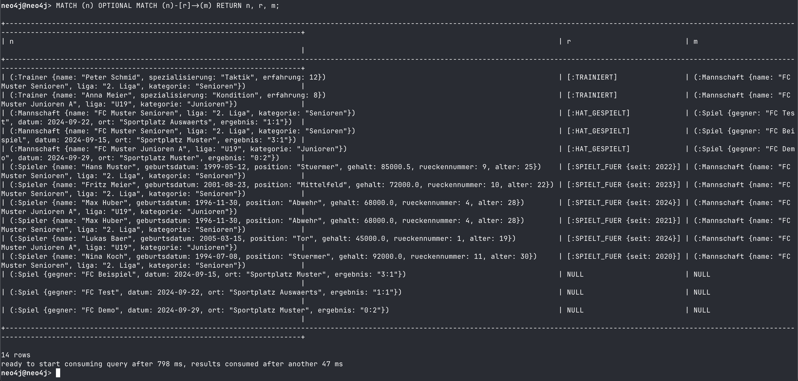

**Szenario 2: Trainer mit Erfahrung > 10 und ihre Mannschaften**

Welche Trainer haben lange Erfahrung und welche Mannschaften trainieren sie?
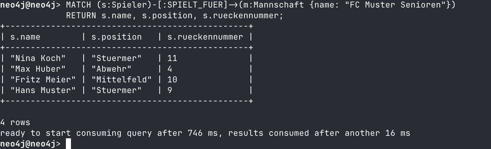

**Szenario 3: Alle Spiele der Senioren mit Ergebnis, wo sie nicht verloren haben**

Nur Spiele die nicht verloren wurden (Sieg oder Unentschieden). Wird fuer den Ticketverkauf des naechsten Heimspiels benoetigt.
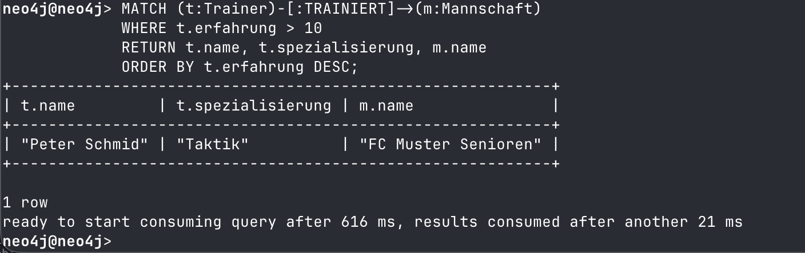

**Szenario 4: Spieler die in mehreren Mannschaften gespielt haben und ihre Beitrittsjahre**

Fuer die Vereinshistorie - wer ist schon ueberall gewesen?
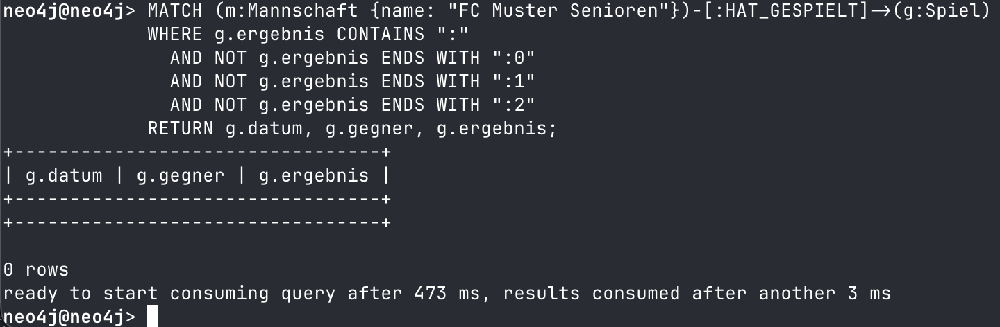

---

## Teil C: Daten loeschen (20%)

Ich habe zweimal das gleiche Startobjekt (einen Spieler) genommen, einmal mit DETACH und einmal ohne.

### Ohne DETACH

**Vorher:**

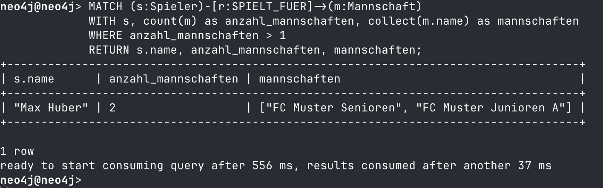

**Nachher (ohne DETACH):**

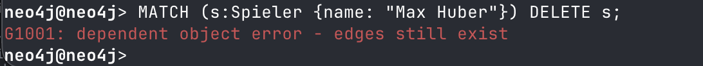

**Fehler:** Neo4j loescht nicht, weil der Knoten noch Beziehungen hat. Es kommt eine Fehlermeldung:

### Mit DETACH

**Funktioniert:** Loescht den Knoten **und** alle seine Beziehungen (aus- und eingehende).

**Nachher (mit DETACH):**

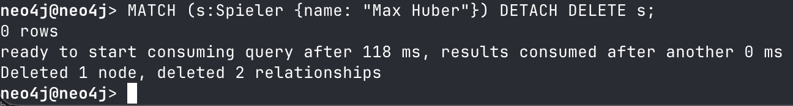

---

## Teil D: Daten veraendern (20%)

### Szenario 1: Gehaltserhoehung fuer einen bestimmten Spieler

Hans Muster hatte eine gute Saison, er soll mehr Gehalt bekommen.

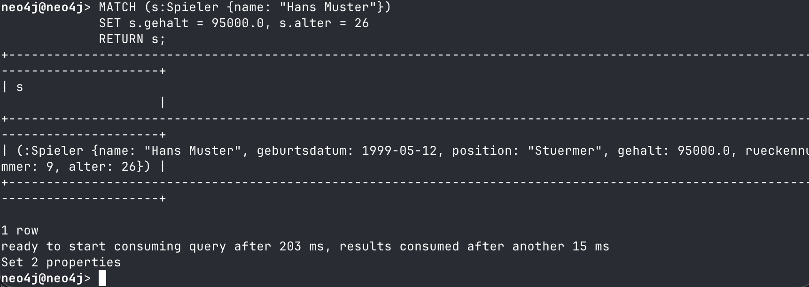

### Szenario 2: Erfahrung aller Trainer erhoehen

Alle Trainer die Taktik oder Kondition als Spezialisierung haben, bekommen ein Jahr Erfahrung dazu.

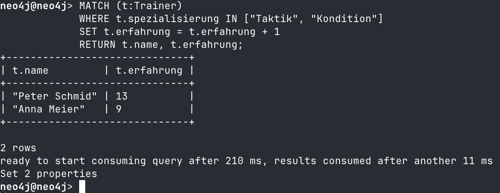

### Szenario 3: Ergebnis eines Spiels korrigieren

Der FC Muster hat gegen "FC Demo" doch 2:1 gewonnen (statt 0:2 verloren).

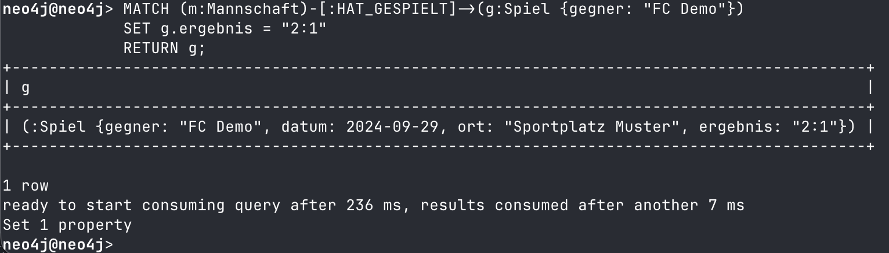

---

## Teil E: Zusaetzliche Klauseln (20%)

Ich habe mich fuer `MERGE` und `CASE` entschieden. Mit meinen Kollegen abgesprochen - die anderen haben `UNWIND` und `FOREACH` genommen.

### 1. MERGE

**Theorie:** `MERGE` kombiniert `MATCH` und `CREATE`. Es schaut ob ein Knoten (oder Kante) mit diesen Eigenschaften schon existiert. Wenn ja, passiert nichts. Wenn nein, wird er erstellt. Das ist praktisch fuer "Upsert" - also zum Verhindern von doppelten Daten.

**Beispiel:** Einen neuen Spieler "Marco Weber" einfuegen - wenn er schon existiert soll nichts passieren.

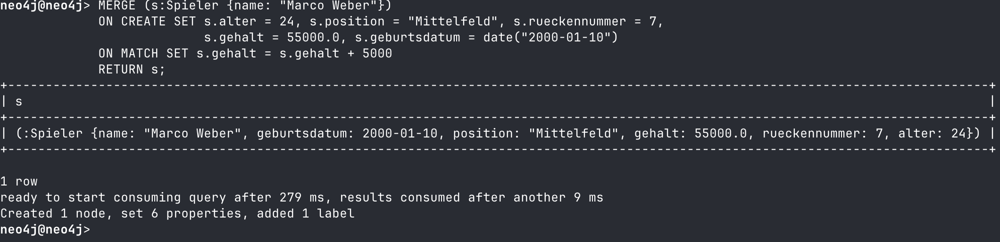

**Erklaerung:** `ON CREATE SET` wird nur ausgefuehrt, wenn der Knoten nicht existiert. `ON MATCH SET` wird ausgefuehrt, wenn er schon da ist. So kann man beide Faelle behandeln.

### 2. CASE

**Theorie:** `CASE` ist wie ein `if-else` in anderen Programmiersprachen. In Cypher kann man `CASE` innerhalb von `RETURN` verwenden um bedingte Wertzuweisungen zu machen.

**Beispiel:** Alle Spieler in Kategorien einteilen - "Jungstar" (unter 21), "Stammspieler" (21-29) oder "Erfahren" (30+).

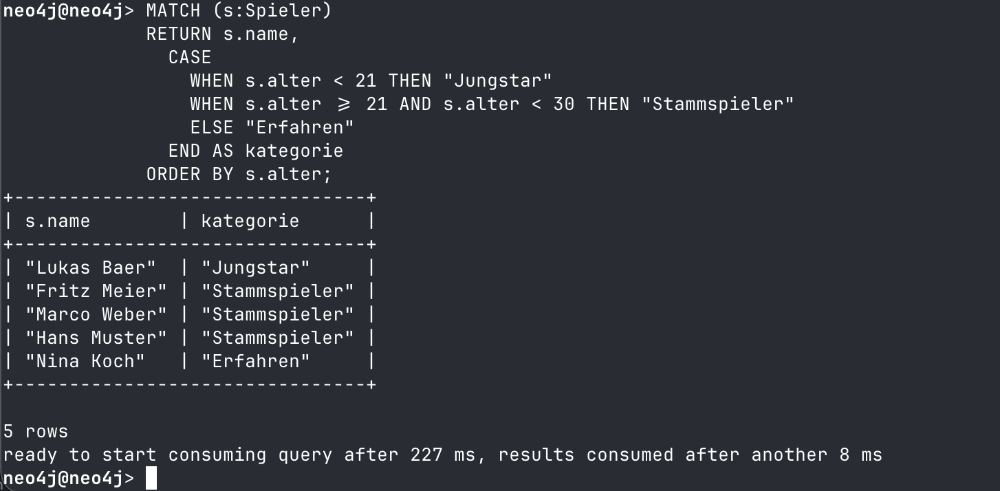

**Erklaerung:** Es wird kein neuer Wert gespeichert, sondern nur bei der Ausgabe transformiert. Die Reihenfolge der `WHEN`-Bedingungen ist relevant - es wird der erste passende Fall genommen.