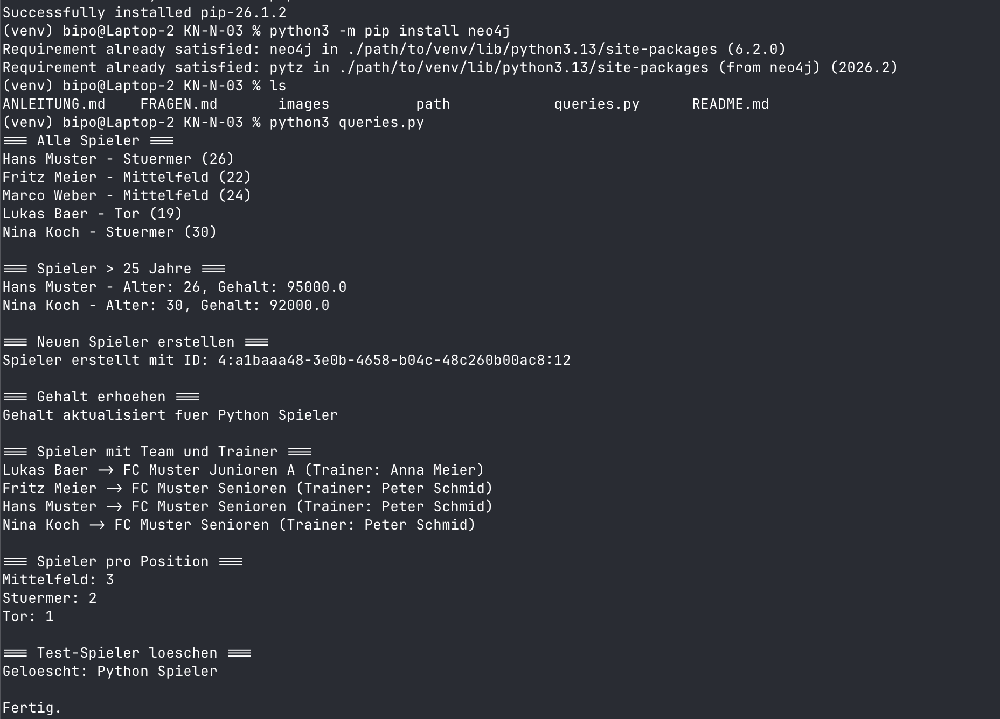
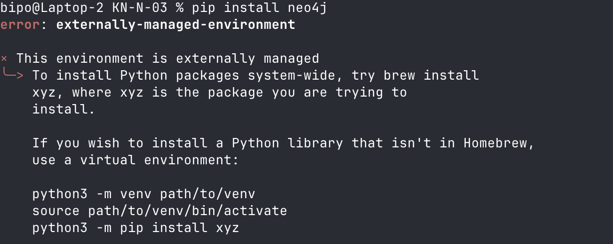

# KN-N-03 - Programmierung mit Neo4j

Ich habe Python mit dem `neo4j`-Driver gewaehlt um auf die Neo4j-Datenbank zuzugreifen. Script: `queries.py`

---

## Setup

```bash
pip install neo4j
```

Verbindung zur AWS-Instanz:

```python
from neo4j import GraphDatabase

URI = "neo4j://<IP>:7687"
AUTH = ("neo4j", "<Password>")

driver = GraphDatabase.driver(URI, auth=AUTH)
```

Der Driver braucht eine URI (`neo4j://`), Benutzername und Passwort - aehnelich wie bei der cypher-shell.

---

## Abfragen aus KN-N-02

### Alle Spieler abfragen

```python
def get_all_spieler(tx):
    result = tx.run("MATCH (s:Spieler) RETURN s.name, s.position, s.alter")
    for record in result:
        print(f"{record['s.name']} - {record['s.position']} ({record['s.alter']})")

with driver.session(database="neo4j") as session:
    session.execute_read(get_all_spieler)
```

### Spieler mit Filter (Alter > 25)

```python
def get_aeltere_spieler(tx):
    result = tx.run(
        "MATCH (s:Spieler) WHERE s.alter > $min_alter "
        "RETURN s.name, s.position, s.alter, s.gehalt ORDER BY s.alter",
        min_alter=25
    )
    for record in result:
        print(f"{record['s.name']} - Alter: {record['s.alter']}, Gehalt: {record['s.gehalt']}")

with driver.session(database="neo4j") as session:
    session.execute_read(get_aeltere_spieler)
```

Die Parameteruebergabe mit `$min_alter` verhindert Cypher-Injection - sollte man immer so machen!

### Neuen Spieler einfuegen

```python
def create_spieler(tx, name, alter, position, nummer, gehalt, geburtsdatum):
    result = tx.run(
        "CREATE (s:Spieler {name: $name, alter: $alter, position: $position, "
        "rueckennummer: $nummer, gehalt: $gehalt, geburtsdatum: date($geburtsdatum)}) "
        "RETURN elementId(s)",
        name=name, alter=alter, position=position,
        nummer=nummer, gehalt=gehalt, geburtsdatum=geburtsdatum
    )
    for record in result:
        print(f"Spieler erstellt mit ID: {record['elementId(s)']}")

with driver.session(database="neo4j") as session:
    session.execute_write(create_spieler, "Python Spieler", 24, "Mittelfeld", 14, 70000.0, "2000-06-15")
```

### Update (Gehaltserhoehung)

```python
def update_gehalt(tx, name, neues_gehalt):
    tx.run(
        "MATCH (s:Spieler {name: $name}) SET s.gehalt = $neues_gehalt",
        name=name, neues_gehalt=neues_gehalt
    )
    print(f"Gehalt updated fuer {name}")

with driver.session(database="neo4j") as session:
    session.execute_write(update_gehalt, "Python Spieler", 75000.0)
```

### Delete

```python
def delete_spieler(tx, name):
    tx.run("MATCH (s:Spieler {name: $name}) DETACH DELETE s", name=name)
    print(f"Geloescht: {name}")

with driver.session(database="neo4j") as session:
    session.execute_write(delete_spieler, "Python Spieler")
```

### Komplexere Abfrage: Spieler mit Mannschaft und Trainer

```python
def get_spieler_mit_team(tx):
    query = """
    MATCH (s:Spieler)-[:SPIELT_FUER]->(m:Mannschaft)<-[:TRAINIERT]-(t:Trainer)
    RETURN s.name AS spieler, m.name AS mannschaft, t.name AS trainer
    ORDER BY m.name, s.name
    """
    result = tx.run(query)
    for record in result:
        print(f"{record['spieler']} -> {record['mannschaft']} (Trainer: {record['trainer']})")

with driver.session(database="neo4j") as session:
    session.execute_read(get_spieler_mit_team)
```

### Aggregation: Spieler pro Position

```python
def count_per_position(tx):
    result = tx.run(
        "MATCH (s:Spieler) RETURN s.position AS position, count(*) AS anzahl "
        "ORDER BY anzahl DESC"
    )
    for record in result:
        print(f"{record['position']}: {record['anzahl']}")

with driver.session(database="neo4j") as session:
    session.execute_read(count_per_position)
```

---

Driver schliessen nicht vergessen:

```python
driver.close()
```

Screenshots:



